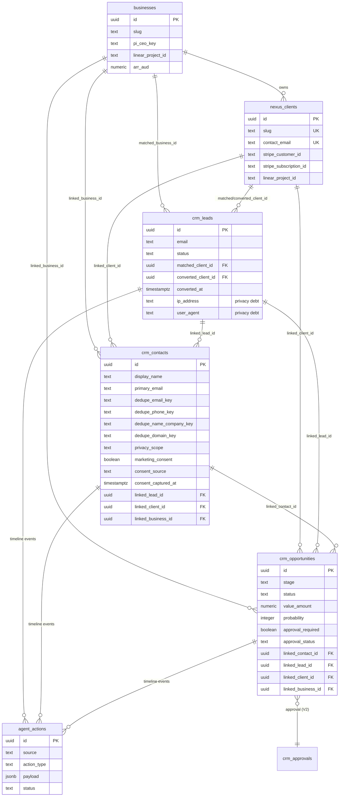
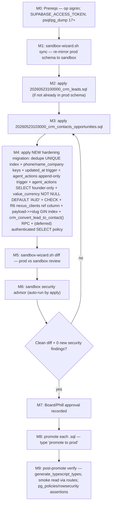

# Data Model & ERD — Authority-Site In-House CRM

> **Companion artifact to [`/spec.md`](../../spec.md) §6 (Domain & Data Architecture).** Full entity model, ERD, dedupe-key strategy, privacy scopes, RLS posture, and the sandbox-first migration plan for the V1 tables.
>
> **Source-of-truth law (locked):** Supabase = CRM truth; Stripe = billing truth; Linear = execution truth. CRM objects mirror but never overwrite the truth source.
>
> **Migration law (locked):** every schema change routes through `scripts/sandbox-wizard.sh` (sandbox `apply` → `diff` → `promote` with typed `promote to prod`). No direct `psql`, `supabase db push`, or MCP `apply_migration` against prod ref `lksfwktwtmyznckodsau`. Sandbox ref `xgqwfwqumliuguzhshwv` mirrors prod via `pg_dump --schema-only`.
>
> **Cross-links:** [spec.md](../../spec.md) · [feature-coverage-matrix.md](./feature-coverage-matrix.md) · [phase-plan.md](./phase-plan.md)
>
> **Evidence tags:** `[VERIFIED]` = read in the named file · `[INFERENCE]` = reasoned · `[UNCONFIRMED]` = could not verify.

---

## 1. Entity model overview

The CRM spine layers on the existing Nexus identity tables. Three identity anchors are expected to exist in prod (`businesses`, `nexus_clients`, `agent_actions`); the CRM extends them rather than replacing them. **Prod-applied state is `[UNCONFIRMED]` (see the evidence-integrity note below)** — migration files are present in the repo, but the only machine-readable prod-schema artifact does not corroborate them, so M1.1 must verify each FK-target table exists in prod **before** promoting contacts/opportunities. There is **no separate `accounts`/`organizations` table in V1** — org identity is carried by `businesses` (portfolio operating units) and `nexus_clients` (paying clients); `crm_contacts.company_name` is a free-text label until a V2 `crm_accounts` table normalizes it. `[INFERENCE — grounded in the single-tenant lock and the existing businesses/nexus_clients split]`

> **⚠ Evidence-integrity note (BLOCKER B1 — Data Architecture).** The only machine-readable prod-schema artifact in the repo, `types/supabase.ts` (generated from prod ref `lksfwktwtmyznckodsau`, **dated 2026-05-22 19:03** `[VERIFIED — file mtime + header]`), contains **no `public.Tables` definition** for `crm_leads`, `agent_actions`, or `nexus_clients` — only an unrelated `client_agent_actions` table and `businesses` are present `[VERIFIED — grep over types/supabase.ts]`. The migration *files* exist in `supabase/migrations/`, but "file in repo" is **not** "applied in prod." Every table below tagged "prod-applied" is therefore **`[UNCONFIRMED]` against the prod source of truth**, not `[VERIFIED]`. **Mandatory pre-M1.1 step:** regenerate `types/supabase.ts` from prod (`npm run gen:types` or `sandbox-wizard sync` + `diff`), commit it as the §17 evidence baseline, and have M1.1 explicitly verify each FK-target table (`crm_leads`, `nexus_clients`, `businesses`) exists in prod before the promote transaction runs — its FK references will fail otherwise.

| Entity | Status | Role | Migration |
|---|---|---|---|
| `businesses` | `[UNCONFIRMED prod-applied]` — `businesses` def present in `types/supabase.ts` | Portfolio operating units (org identity) | migration in repo (nexus_businesses) |
| `nexus_clients` | `[UNCONFIRMED prod-applied]` — **absent from `types/supabase.ts`** | Paying clients (org identity, billing links) | migration in repo (nexus_clients) |
| `agent_actions` | `[UNCONFIRMED prod-applied]` — **absent from `types/supabase.ts`** (only `client_agent_actions` present) | Unified audit / activity timeline | `20260510000004_nexus_agent_actions.sql` `[VERIFIED file]` |
| `crm_leads` | migration in repo; **prod-applied state to be confirmed by `gen:types` before M1.1** | Inbound lead capture | `20260523100000_crm_leads.sql` `[VERIFIED file]` |
| `crm_contacts` | DRAFTED, not applied to sandbox or prod | Canonical people record | `20260523103000_crm_contacts_opportunities.sql` `[VERIFIED file]` |
| `crm_opportunities` | DRAFTED, not applied to sandbox or prod | Pipeline / forecast (forecast-only, NOT billing truth) | `20260523103000_crm_contacts_opportunities.sql` `[VERIFIED file]` |
| `crm_accounts` | not built | Normalized org entity | V2 |
| `crm_opportunity_line_items` | not built | Products/quotes on opportunities | V2 |
| `crm_approvals` | not built | Dedicated approval history/query store | V2 (Stage-2; V1 uses task-subtype model) |
| `activity_timeline` (dedicated) | not built | Typed timeline table | V3+ (only if `agent_actions` query/RLS limits are proven) |

---

## 2. ERD

### Verified relationship facts

- `crm_leads` references `nexus_clients(id)` via `matched_client_id` and `converted_client_id`, and `businesses(id)` via `matched_business_id`, all `ON DELETE SET NULL` — `supabase/migrations/20260523100000_crm_leads.sql:21-23`. `[VERIFIED]`
- `crm_contacts` links to `crm_leads`, `nexus_clients`, `businesses` via `linked_lead_id` / `linked_client_id` / `linked_business_id`, all `ON DELETE SET NULL` — `…103000.sql:15-17`. `[VERIFIED]`
- `crm_opportunities` links to lead, contact, client, business — `…103000.sql:91-94`; FK `linked_contact_id → crm_contacts(id)` at `…103000.sql:92` establishes the **apply-ordering constraint (contacts before opportunities)**. `[VERIFIED]`
- The unified timeline is carried by `agent_actions`, keyed by `action_type = 'crm_timeline_<event_type>'` with a sanitized `payload` — mapper `src/lib/crm/activity-timeline.ts:217-256`. `[VERIFIED]`

---

## 3. Dedupe keys & strategy (V1)

Dedupe is **detect-and-block on write** in V1 (no auto-merge — auto-merge is a high-risk approval subject, see §5). The migration declares four `dedupe_*` text columns but **adds no UNIQUE constraint/index** (`grep -ni unique …103000.sql` → none) `[VERIFIED gap]`, and the contacts route currently computes only `dedupe_email_key` + `dedupe_domain_key` (`src/app/api/crm/contacts/route.ts:261-262`) — `dedupe_phone_key` and `dedupe_name_company_key` are always null. `[VERIFIED gap]`

| Key | Derivation | Confidence | V1 enforcement |
|---|---|---|---|
| `dedupe_email_key` | `lower(trim(primary_email))` | **strong** | partial UNIQUE index + app pre-check (block-on-alone) |
| `dedupe_phone_key` | digits-only, last 10–12 normalized (E.164-ish) | medium | index + soft warn (collision → 409 only with email/name corroboration) |
| `dedupe_name_company_key` | `lower(trim(first_name\|\|' '\|\|last_name)) \| lower(trim(company_name))` (**stable normalized full-name**, NOT the mutable `display_name`) | weak | index + soft warn only; **advisory-only — never drives an automatic 409 on its own** |
| `dedupe_domain_key` | email domain | hint-only | index; **never** a dedupe trigger alone |

**Rules** (carry the operating-model identity policy, `docs/margot/crm-operating-model.md:116-137`): email is the only key strong enough to block on alone; domain is "a hint, not proof"; phone/name+company block only when a second key corroborates. App-layer behavior today: `existingContactConflictByEmail` returns `409 crm_contact_conflict` on email-key match; Postgres unique violation `23505` is also mapped to `409` (`…contacts/route.ts:284-285`). `[VERIFIED]`

**Dedupe-key stability decision (P21 — Data Architecture):** `dedupe_name_company_key` MUST be derived from a **stable normalized full-name** (`first_name`+`last_name`), not from the mutable/derived `display_name` (which `deriveDisplayName` recomputes on rename, silently changing dedupe identity). Because the name+company key is weak and rename-sensitive, it is **advisory-only**: it surfaces a possible-duplicate pip in the UI but never triggers an automatic 409 by itself — a 409 always requires a strong (email) or corroborated (phone+name) match. **PATCH must recompute `dedupe_phone_key` and `dedupe_name_company_key`** alongside the email keys (today PATCH recomputes only email keys), so the keys never drift out of sync with the row.

**V1 hardening (NEW additive migration, sandbox-first):**
1. Add a **partial UNIQUE index** on `dedupe_email_key` (`WHERE dedupe_email_key IS NOT NULL`) so the DB is the authoritative backstop, closing the route-layer TOCTOU race.
2. Populate **all four** dedupe keys in the contacts route (name+company from the stable full-name, per the stability decision above); back phone/name_company with indexes; recompute phone/name_company keys on PATCH.
3. Add a `set_updated_at` **BEFORE UPDATE trigger** on `crm_contacts`/`crm_opportunities` (reuse the proven pattern in `supabase/migrations/20260514142500_client_approvals.sql`) — `updated_at` is currently only refreshed by app code. `[VERIFIED gap]`

---

## 4. Privacy scopes

`crm_contacts.privacy_scope` (CHECK ∈ `lead_scoped`, `client_scoped`, `business_scoped`, `restricted`, `global_crm`; `NOT NULL DEFAULT 'lead_scoped'`) is the per-record visibility band — `…103000.sql:39-41`. `[VERIFIED]` In single-tenant V1 every operator can read all scopes (RLS is service-role only); scopes are **forward-compatible metadata** that becomes load-bearing when V3+ granular RBAC arrives, and they drive redaction in surfaces today.

Privacy obligations carried into the data layer:
- **PII redaction in timeline** is enforced at write time (`src/lib/crm/activity-timeline.ts:105-153`) — strips email/phone/token/payment/board-ref patterns; the contacts route re-sanitizes the subject label (`…contacts/route.ts:65-85`). The unified timeline never persists raw PII even though contacts/leads do. `[VERIFIED]`
- **`crm_leads` IP/user-agent retention** is an unresolved privacy debt that is **live and exploitable today**: `marketing/leads/route.ts:124-125` stores raw `ip_address` (from `x-forwarded-for`/`x-real-ip`, line 64) and `user_agent` as plaintext `text` on the one anonymous public write surface, and line 126 stores `leadData.additionalData` **verbatim with no redaction filter** `[VERIFIED]`. **V1 blocking decision (P10):** at insert on `marketing/leads`, either (a) **hash or truncate** `ip_address`/`user_agent` with a stated retention window (30–90 days) or drop the columns, AND (b) apply the shared `safe-additional-data` filter (§11.3 / `src/lib/security/safe-additional-data.ts`, **new module**) plus a strict size cap to the public route. Because real PII lands at go-live, pull a **minimal insert-time hash (or retention-sweeper stub) into V1** — OR state plainly that V1 only *records* the retention decision and enforcement is V2, with Phill's recorded sign-off in §15.3. The contacts `retention_policy` column is written by no route today and is decorative until the V2 sweeper. `[VERIFIED debt]`
- **Consent** is first-class on contacts (`marketing_consent`, `consent_source`, `consent_captured_at` — `…103000.sql:20-22`) and leads (`marketing_consent` — `…crm_leads.sql:15`), but the contacts route writes only `marketing_consent` today (`…contacts/route.ts:257`; the insert payload omits both provenance columns) `[VERIFIED gap]`. **V1 acceptance with teeth (P9):** whenever `marketing_consent` transitions to `true` on either the contacts route or `marketing/leads`, the route MUST write `consent_source` + a **server-side** `consent_captured_at` (never a client-trusted timestamp). A write asserting `marketing_consent: true` with no resolvable `consent_source` is **rejected (422)**. `do_not_contact` status is a hard **server-side** block on any send/sequence path before V2 comms ships. `[VERIFIED gap]`

---

## 5. RLS posture

**Current posture: every CRM truth table is RLS-enabled with a single `service_role` ALL policy and no authenticated/anon policy.** All reads/writes route through service-role server routes gated by `requireAdmin`. `[VERIFIED]`

| Table | RLS | Policies | Path |
|---|---|---|---|
| `crm_leads` | enabled | `service_role` ALL only | `…crm_leads.sql:44-63` |
| `crm_contacts` | enabled | `service_role` ALL only | `…103000.sql:59-78` |
| `crm_opportunities` | enabled | `service_role` ALL only | `…103000.sql:151-171` |
| `agent_actions` | enabled | `service_role` ALL **+ authenticated SELECT `USING(true)`** | `…nexus_agent_actions.sql:29-37` |
| `nexus_clients` | enabled | `service_role` ALL + authenticated SELECT | `…nexus_clients.sql:30-40` |
| `data_room_documents` | enabled | `service_role` ALL + founder-email SELECT | `…data_room_documents.sql:65-74` |

**V1 RLS plan:**
- Keep service-role-only writes on `crm_contacts`/`crm_opportunities`. The `service_role` ALL policy is the safety floor — no client-side write path is ever opened to CRM tables. `[INFERENCE — extends the verified existing pattern]`
- Add an **`authenticated` SELECT** policy to both **only once** the privacy-scope redaction story for client-scoped reads is confirmed; until then, reads stay service-role-routed. (Matches the existing `nexus_clients`/`agent_actions` pattern.)
- **Tighten `agent_actions` SELECT** to founder-email-only (mirror `data_room_documents`) before any second authenticated principal (V2 ops team) exists — today's `authenticated SELECT USING(true)` is over-broad read of the entire audit trail. `[VERIFIED gap — G-RLS-1]`
- Add a **BEFORE UPDATE OR DELETE trigger** on `agent_actions` to enforce append-only at the DB layer (audit is currently append-only by convention only). Pattern: `enforce_profiles_role_immutability` in `20260513000001_ra3008_security_hardening.sql:28`. `[VERIFIED]`

**RLS acceptance (verify in sandbox post-apply):**
- Anon key against `crm_contacts`/`crm_opportunities`/`crm_leads` returns **0 rows**.
- Authenticated non-founder key returns **0 rows** from CRM truth tables and `agent_actions` (after tightening).
- Every CRM table has `rowsecurity = true` and ≥1 policy.

**V3+ RLS:** when granular RBAC lands, `privacy_scope` becomes a predicate (e.g. `restricted` rows readable only by an `ops_admin` claim). The columns already exist, so this is policy-only, no schema change. `[INFERENCE]`

---

## 6. Approvals & timeline persistence (data-layer view)

- **Approvals (V1): no dedicated table.** Decision is locked to the **Stage-1 task-subtype** model (`docs/margot/crm-schema-inventory.md:65,238`); the approval *decision* engine is pure-logic (`src/lib/crm/approval-lifecycle.ts`) and `safeToAutoExecute` is hard-`false` everywhere — the recommendation-only safety contract is structurally enforced. `crm_opportunities` already carries `approval_required`/`approval_status` for inline pipeline gating. No `crm_approvals` migration exists. `[VERIFIED]`
- **`crm_approvals` table is V2** — built sandbox-first only when structured approval history/query needs are proven (states requested/approved/rejected/expired/cancelled/executed; links requester/approver/reason/scope/risk/related-object/audit-event). `[VERIFIED plan]`
- **Timeline (V1): extend `agent_actions`**, do not add a table. The 16-event taxonomy is fixed in `src/lib/crm/activity-timeline.ts:1-17`. A dedicated timeline table is V3+ and only if query/RLS needs justify it. `[VERIFIED]`
- **Known FK gap (R6 — promoted to a V1 hardening line item).** `agent_actions.client_id REFERENCES public.clients(id) ON DELETE SET NULL` (`…nexus_agent_actions.sql:13`), **NOT `nexus_clients`** `[VERIFIED]`. Since the unified `agent_actions` timeline is the V1 backbone for per-entity filtering, a client-id pointing at a legacy/empty `public.clients` table is a silent referential-integrity hole. **V1 fix (in the M1.1 hardening migration, sandbox-first):** add a corrected `nexus_clients`-referencing column (or repoint the FK), with an acceptance that timeline events resolve to `nexus_clients`, not `public.clients`. This earns a feature-matrix Pillar 4 row. **Per-entity timeline reads filter on `payload->>'slug'` (and `payload->>'subjectId'`)** — add a **GIN/expression index** on `payload->>'slug'` in the same hardening migration so the timeline read path is indexed, not a full-jsonb scan. If any part is deferred to V2, the spec must justify why V1 per-entity filtering is unaffected. `[VERIFIED gap]`

### 6.1 Conversion atomicity — single SECURITY DEFINER RPC (P5, platform constraint)

**Platform constraint stated explicitly:** the supabase-js client has **no multi-statement transaction primitive** across separate REST calls. The existing convert route proves the problem — it does a non-transactional `.update()` on `crm_leads` (`…convert/route.ts:172`) then a *best-effort* `recordLeadConversionTimelineEvent` insert wrapped in try/catch that swallows failures (`:63-82,182`) `[VERIFIED]`. A lead→contact(+opportunity)→lead-status→audit chain built as chained SDK calls is **partially committable** (e.g. contact created, opportunity insert fails → orphaned contact, lead half-converted), so the §8 acceptance "atomically or with compensating cleanup" is **unmeetable as chained SDK calls**.

**Decision (closes OQ-6):** multi-row CRM conversion runs inside **one Postgres transaction** via a **`SECURITY DEFINER` RPC `crm_convert_lead_to_contact(...)`**, promoted sandbox-first in the M1.1/M1.2 scope, invoked via `supabase.rpc()`. The RPC performs, in a single transaction: deduped `crm_contacts` upsert ← lead fields → optional `crm_opportunities` seed → `crm_leads` status update → exactly one `agent_actions` audit insert. Compensating-saga is the *only* fallback if an RPC is rejected, and must be specified with explicit partial-failure ordering if chosen. Request/response JSON schema (lead→contact field mapping, opportunity-seed opt-in, `dryRun`, 409/partial shapes) is defined in spec.md §7.5.

### 6.2 Forecast currency model (P6, single-currency by construction)

`crm_opportunities.value_currency` is today a **nullable free-text `text` column with NO `DEFAULT` and NO `CHECK`** (`…103000.sql:86`) `[VERIFIED]`; the route only defaults `'AUD'` when `valueAmount` is supplied (`…opportunities/route.ts:423,527`) and otherwise accepts any of `safeValueCurrencies = ['AUD','USD','NZD','GBP','EUR']` (`:29`) `[VERIFIED]`. A forecast `Σ(value_amount × probability)` therefore sums across mixed/null currencies, making "matches API to the cent" meaningless. **V1 hardening-migration decision:** pin `value_currency NOT NULL DEFAULT 'AUD'` with a `CHECK (value_currency = 'AUD')` so the forecast is **single-currency by construction**; the forecast endpoint asserts a single currency. Multi-currency + FX normalization is a V2 item (per-currency forecast grouping with an FX strategy). The single-currency assumption is stated in spec.md §1 and M1.6 acceptance.

---

## 7. Sandbox-first migration plan (V1 tables → prod)

Every step runs against sandbox ref `xgqwfwqumliuguzhshwv`; prod ref `lksfwktwtmyznckodsau` is touched only by `promote`. Sourced from `scripts/sandbox-wizard.sh:10-17,411-431,489-523` and `CLAUDE.md`. `[VERIFIED]`

**Ordering constraint (verified):** `crm_contacts` must exist before `crm_opportunities` (FK `linked_contact_id → crm_contacts(id)`), and both must exist after `crm_leads` and `nexus_clients`/`businesses`. The combined migration already orders contacts (`…103000.sql:6`) before opportunities (`:80`) and applies as one transaction (`sandbox-wizard apply` runs `--single-transaction --set ON_ERROR_STOP=on`). `[VERIFIED]`

**Idempotency note:** all CRM migrations use `create table if not exists` + `do $$ … if not exists … create policy …` guards, so re-apply to an already-seeded sandbox is safe. The new hardening migration must follow the same discipline. `[VERIFIED]`

---

## 8. "Data layer is done when" (V1 acceptance)

0. **(Pre-M1.1, mandatory) `types/supabase.ts` regenerated from prod ref `lksfwktwtmyznckodsau` and committed as the §17 evidence baseline; M1.1 verifies `crm_leads`, `nexus_clients`, `businesses` exist in prod BEFORE the contacts/opportunities promote transaction runs.**
1. `crm_contacts` and `crm_opportunities` exist in prod, applied **only** via `sandbox-wizard promote`, with a clean `diff` and zero new security-advisor findings captured as evidence.
2. A partial UNIQUE index on `dedupe_email_key` exists in prod; all four dedupe keys are populated by the contacts route (name+company from the stable full-name, advisory-only); phone/name_company keys are indexed; PATCH recomputes phone/name_company keys.
3. `crm_contacts`/`crm_opportunities` each have a working `updated_at` BEFORE-UPDATE trigger.
4. Lead→contact conversion runs through the **`crm_convert_lead_to_contact()` SECURITY DEFINER RPC** (single Postgres transaction — chained supabase-js SDK calls are NOT acceptable): materializes a deduped `crm_contacts` row (and optional opportunity), updates lead status, and emits exactly one `agent_actions` timeline event, all-or-nothing; double-convert returns 409; no orphaned-contact partial commit is possible.
5. RLS: service-role ALL retained; `authenticated` SELECT added only with privacy-scope redaction confirmed; **`agent_actions` SELECT tightened to founder-email-only in the M1.1 hardening migration, with an exit assertion that an authenticated-non-founder key returns 0 rows from `agent_actions`** (landing BEFORE ops-team principals are provisioned and BEFORE M1.8-FB email/cal metadata lands in the table); `agent_actions` append-only enforced by a BEFORE UPDATE OR DELETE trigger (inserts still succeed; updates/deletes rejected); no client-side write path to any CRM table.
6. `crm_leads` IP/user-agent retention decision recorded and implemented (hash/truncate + window) — or the columns dropped; the shared `safe-additional-data` filter applied to `marketing/leads` with a size cap.
7. The unified timeline (`agent_actions`) carries lead/contact/opportunity/approval events with PII redaction verified by test; `client_id`/timeline events resolve to `nexus_clients` (R6 corrected) and the `payload->>'slug'` read path is indexed.
8. **Forecast is single-currency by construction**: `value_currency NOT NULL DEFAULT 'AUD'` with `CHECK (value_currency = 'AUD')`; the forecast endpoint refuses to sum across currencies.
9. **Consent provenance**: any write setting `marketing_consent = true` records `consent_source` + a server-side `consent_captured_at`; a consent=true write with no provenance is rejected (422).

---

*See [`/spec.md`](../../spec.md) §6, §11, §12 for the narrative, [`phase-plan.md`](./phase-plan.md) for sequencing, and [`feature-coverage-matrix.md`](./feature-coverage-matrix.md) for the full feature inventory.*
