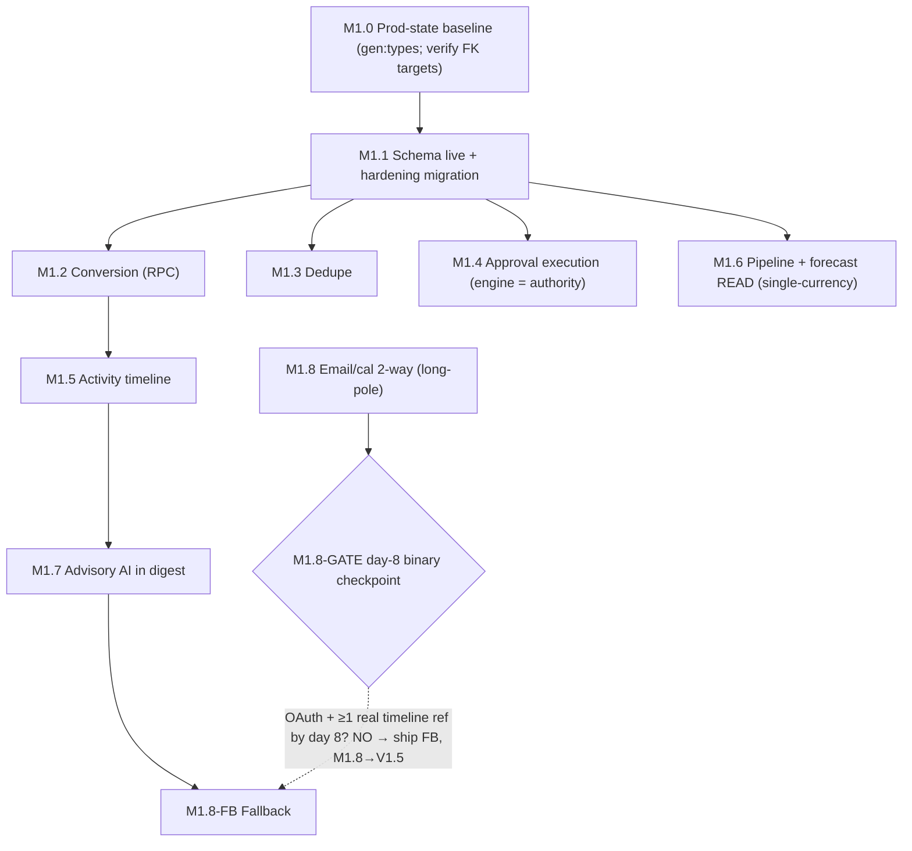

# Phased Delivery Plan — Authority-Site In-House CRM

> **Companion artifact to [`/spec.md`](../../spec.md) §13 (Phased Delivery Plan).** Detailed V1 → V2 → V3+ scope, milestones, exit criteria, engineer-day estimates, dependencies, and the email/calendar long-pole + fast-follow fallback.
>
> **Cross-links:** [spec.md](../../spec.md) · [feature-coverage-matrix.md](./feature-coverage-matrix.md) · [data-model-erd.md](./data-model-erd.md)

## Estimation basis

- Effort in **engineer-days (ed)**: one senior (15+ yr) full-stack engineer, including implementation + tests + sandbox apply/diff + PR review.
- **Blended day-rate assumption: AUD $1,200 / engineer-day** `[INFERENCE — surfaced as Open Question OQ-1; confirm before treating costs as firm]`. Indicative cost = ed × rate; all costs scale linearly if the rate changes.
- Estimates assume the existing pure-logic engines (`qualify-lead`, `approval-lifecycle`, `daily-digest`, `activity-timeline`) are **reused, not rebuilt** `[VERIFIED they exist]`.

> **Arithmetic reconciled (P4 / BLOCKER B4):** the V1 headline equals the sum of its own milestones — M1.1…M1.8 sum to **44 ed** (4+5+3+5+4+5+4+14); fallback (M1.8→M1.8-FB) is **34 ed**. No parallelization discount is assumed (any future overlap is a named line item).

| Phase | Core effort (ed) | Indicative cost (AUD) |
|---|--:|--:|
| V1 (full email/cal sync) | **44** | **$52,800** |
| V1 (with read-only fallback instead of full sync) | **34** | **$40,800** |
| V2 | 49 | $58,800 |
| V3+ | 42 | $50,400 |
| **Program total (V1 core + V2 + V3+)** | **135** | **$162,000** |

---

## V1 — Core CRM spine + advisory AI + email/cal (LOCKED scope)

**Goal:** Phill can capture a lead, qualify it with advisory AI, convert it to a contact + opportunity, watch it move through a forecastable pipeline, and act on a human-approved next-best-action — entirely inside the command-center, with every CRM object backed by a sandbox-promoted Supabase table, zero AI auto-writes, and Supabase/Stripe/Linear holding their respective truths.

```mermaid
gantt
    title V1 Critical Path
    dateFormat  X
    axisFormat %s
    section Schema
    Sandbox apply + promote contacts/opps   :a1, 0, 4
    section CRM
    Conversion lead->contact->opp           :a2, after a1, 5
    Dedupe (phone + name+company)           :a3, after a1, 3
    Approval execution handler              :a4, after a1, 5
    Unified activity timeline               :a5, after a2, 4
    section Read
    Pipeline + forecast dashboard           :a6, after a1, 5
    section AI
    Advisory AI in daily digest             :a7, after a5, 4
    section LONG-POLE
    Email/cal 2-way sync (OAuth+tokens)     :crit, a8, 0, 14
    Day-8 binary gate (OAuth + 1 real ref)  :milestone, m8, 8, 0
    Fallback read-only digest sync          :a9, 0, 4
```

| Milestone | Description | Exit criteria | Dependencies | Effort (ed) | Cost (AUD) |
|---|---|---|---|--:|--:|
| **M1.0 Prod-state baseline (pre-M1.1, BLOCKER B1)** | Regenerate `types/supabase.ts` from prod ref `lksfwktwtmyznckodsau` (`gen:types` / `sandbox-wizard sync`+`diff`); commit as §17 evidence baseline | `types/supabase.ts` regenerated + committed; `crm_leads`/`nexus_clients`/`businesses` confirmed present in prod (they are absent from the stale 2026-05-22 artifact) BEFORE any promote | prod ref; `op signin` | folded into M1.1 | — |
| **M1.1 Schema live + hardening migration** | Promote `crm_contacts` + `crm_opportunities` to prod via sandbox-wizard, plus the consolidated hardening migration | FK-targets verified present in prod first; `diff` artifact attached; typed "promote to prod" confirm; `list_tables` shows both; RLS service-role policy verified; **hardening migration** = dedupe UNIQUE index + phone/name_company keys (stable full-name) + `updated_at` trigger + **`agent_actions` append-only trigger (inserts succeed, updates/deletes rejected)** + **`agent_actions` SELECT founder-only (authenticated-non-founder = 0 rows exit assertion)** + **`value_currency` NOT NULL DEFAULT 'AUD' + CHECK** + **R6 `nexus_clients` ref column + `payload->>slug` GIN index** + **`crm_idempotency` table** + **CRM-page admin-gate hoisted into a server layout** (the gate is NOT inherited from `command-center/page.tsx`) | M1.0; sandbox-wizard; prod ref | 4 | $4,800 |
| **M1.2 Conversion (RPC-backed, P5)** | lead→contact→opportunity via the **`crm_convert_lead_to_contact()` SECURITY DEFINER RPC** (single Postgres transaction — supabase-js has no client transaction) | RPC materializes a deduped contact + optional opportunity + lead-status + exactly one timeline event, all-or-nothing (no orphaned-contact partial commit); identity-conflict + already-converted return 409; dryRun supported; request/response schema per spec.md §7.5 | M1.1; reuse `crm-lead-conversion.test.ts` | 5 | $6,000 |
| **M1.3 Dedupe** | Add phone + name+company dedupe keys (today only email enforced) | Duplicate by email/phone/name+company returns 409; one test per key; all four `dedupe_*` keys populated (name+company from the **stable full-name**, advisory-only) and indexed; **PATCH recomputes phone/name+company keys** | M1.1 | 3 | $3,600 |
| **M1.4 Approval execution (engine = single authority, B3)** | Wire `POST /api/crm/approvals` + `POST /api/crm/approvals/[id]/execute` onto `approval-lifecycle.ts` as the single approval authority | Opportunities `approval_status` vocabulary **aligned to the engine** `{requested,approved,rejected,cancelled,executed,expired}` (or a documented projection); `approvedBy` captured; `boardApprovalId`→engine-id mapping defined; gated write blocked until `approved`; executes only on `may_execute`; never on `rejected`/`expired`; `safeToAutoExecute:false` preserved; idempotent (409 on re-execute); audit row written | M1.1; approval-lifecycle engine | 5 | $6,000 |
| **M1.5 Activity timeline** | Unified feed across leads/contacts/opps/approvals via `agent_actions` | Timeline renders all four object types; sanitized (PII/secret-redacted) labels; entity-filtered instance powers detail-page rails (filter on the indexed `payload->>slug`); events resolve to `nexus_clients` (R6 corrected) | M1.2 | 4 | $4,800 |
| **M1.6 Pipeline + forecast READ** | Command-center dashboard + `GET /api/crm/opportunities` reading `crm_opportunities` (NOT `agent_actions`) | Gated route (admin-gate hoist confirmed — see M1.1); **single-currency AUD** forecast = Σ(value × probability/100) by stage; weighted + unweighted totals; cockpit-token chart chrome (recharts internals mapped to `--cc-*`); refresh < 2s; no client-side writes; source-of-truth label | M1.1; founder-UI `OpportunityCard` model | 5 | $6,000 |
| **M1.7 Advisory AI in digest** | Join `qualify-lead.ts` scoring + heuristic next-best-action into `daily-digest.ts` (recommendation-only) | Digest shows score + band + NBA per lead; AI writes nothing; "No production DB writes…" safety note preserved; required display language rendered | M1.5; both engines exist | 4 | $4,800 |
| **M1.8 Email/cal 2-way sync — LONG-POLE / CRITICAL PATH** | Net-new: OAuth, encrypted token storage/refresh, message+event read/write, thread→contact linking. Composio today is connection-status mirror ONLY | One provider 2-way; tokens encrypted at rest (never in `additional_data`); signature-verified, per-event-idempotent inbound (re-poll = 0 dup rows; no body/subject in audit); sync < 5 min; failures non-fatal to CRM persistence; outbound send approval-gated/off by default; no message bodies in CRM truth | OAuth app approval (OQ-2); token-at-rest decision (OQ-3) | 14 | $16,800 |
| **M1.8-GATE Binary day-8 checkpoint (P13)** | Objective, owner-signed gate replacing "demonstrably converging" | **By day 8: OAuth connect completes for one provider in sandbox AND inbound poll writes ≥1 real `agent_actions` timeline ref end-to-end.** If either is not demonstrated, M1.8 is cut to V1.5 and M1.8-FB ships. Named milestone, owner-signed — not a judgement call | M1.8 in progress | 0 (gate) | — |
| **M1.8-FB Fallback (fast-follow)** | If M1.8 slips at the day-8 gate: read-only inbound digest sync (surface recent email/cal in digest, no outbound write) | Read-only thread/event surfaced in digest < 24h; clearly labelled "read-only"; ships independently of M1.8 | M1.7; M1.8-GATE | 4 | $4,800 |

**V1 effort (core, full sync): 44 ed ≈ AUD $52,800** (sum of M1.1…M1.8). With fallback instead of full sync (M1.8→M1.8-FB): **34 ed ≈ $40,800.**

### V1 long-pole containment (mandatory rule) — binary day-8 gate

M1.8 is **time-boxed to 14 ed**, and the convergence checkpoint is the **binary, owner-signed M1.8-GATE** above (no subjective "converging" judgement). If the gate is not met, V1 ships with **M1.8-FB** and M1.8 moves to V1.5. This rule exists so email/cal cannot silently stretch the V1 timeline. The fallback satisfies the "activity timeline includes email/calendar" acceptance with zero send capability.

### V1 exit criteria (gate to V2)

- **Prod-state baseline regenerated (M1.0) and FK-targets confirmed in prod before promote.**
- `crm_contacts` + `crm_opportunities` live in prod (sandbox-promoted, `diff` + typed confirm).
- Lead→contact→opportunity conversion working **via the `crm_convert_lead_to_contact()` RPC (single transaction, no partial commit)**; identity-conflict and already-converted return 409.
- Dedupe enforced on email, phone, and name+company (name+company from the stable full-name, advisory-only); duplicate returns 409 with a test per key; PATCH recomputes phone/name+company keys.
- Approval workflow end-to-end via the execution handler with the **engine as single authority** (opportunities vocabulary aligned or projection documented; `approvedBy` captured); `safeToAutoExecute` always false; audit row written.
- Unified activity timeline across leads/contacts/opps/approvals with PII/secret-redacted labels; events resolve to `nexus_clients` (R6).
- Pipeline + forecast dashboard reads `crm_opportunities`, **single-currency AUD** weighted forecast by stage, refreshes < 2s.
- Advisory AI in digest with zero auto-writes; safety note intact.
- Email/cal 2-way sync OR M1.8-FB fallback shipping (M1.8-GATE honored).
- No-Go conditions clear (§15.3): PITR enabled before real PII; public-intake redaction + ip/UA minimization; `agent_actions` read tightened; enforced MFA verified.
- `npm run test:all`, `npm run type-check`, `npm run security:routes-check` all green; ≥80% coverage on `src/lib/crm/*` and CRM routes.

---

## V2 — CRM depth (accounts, comms, docs, reporting, automation)

**Goal:** turn the dashboard into a full CRM — normalized accounts, communications/sequences, documents, reporting with export, workflow automation, a Stripe billing view, the Vercel AI Gateway standup, and an e2e harness.

| Milestone | Description | Exit criteria | Effort (ed) | Cost (AUD) |
|---|---|---|--:|--:|
| M2.1 Accounts/orgs | Normalize companies into `crm_accounts`; contact→account rollup | Account object live (sandbox-promoted); contact rollup; merge w/ approval | 6 | $7,200 |
| M2.2 Email/cal full 2-way | Promote fallback → full if deferred; templates + tracking | Bidirectional; open/click tracking; scheduling | 10 | $12,000 |
| M2.3 Communications & sequences | Templated sends, nurture sequences, Telegram, notifications (Telegram approval-callback exists) | Sequence engine; all sends approval-gated | 8 | $9,600 |
| M2.4 Documents / data room | Attach proposals/files to CRM objects (data-room infra exists) | Attachments on contacts/opps; proposal versioning | 6 | $7,200 |
| M2.5 Reporting & analytics | Win/loss, activity, KPI dashboards, PDF export | Dashboards + PDF export; pipeline trend | 7 | $8,400 |
| M2.6 Workflow automation | Rules/triggers, conditional tasks, SLA timers on approvals | Rule engine; SLA breach → digest/notify | 8 | $9,600 |
| M2.7 Billing view | Stripe ARR/subscription view, receipts (Stripe = billing truth, read-only) | ARR rollup from `integration_stripe_*` mirror; no CRM billing writes | 4 | $4,800 |

Also in V2 (folded into the above where applicable): Vercel AI Gateway + AI SDK provider-string standup with legacy `src/lib/ai/gateway/*` quarantined; LLM NBA rationale / draft-email / summarization / forecast narrative (all advisory, no auto-send); CRM-corpus semantic search with privacy scopes; offline AI eval harness; `crm_approvals` dedicated table (if structured history/query needs are proven); dedicated `client_merge` executor; Playwright e2e added; quarterly DR restore-to-sandbox drill.

**V2 effort: ~49 ed ≈ AUD $58,800.**
**V2 exit:** accounts live; full email/cal 2-way; sequences + automation; reporting w/ export; Stripe billing view; e2e smoke (Playwright) added.

---

## V3+ — Governance, scale, intelligence

| Milestone | Description | Effort (ed) | Cost (AUD) |
|---|---|--:|--:|
| M3.1 Granular RBAC | Per-record/role access; team scoping; `privacy_scope` becomes an active RLS predicate | 8 | $9,600 |
| M3.2 AI layer depth | Draft emails, forecast insight, enrichment (approval-gated suggested edits), summarization, semantic search (recommendation-only) | 10 | $12,000 |
| M3.3 E-sign + proposals | Document e-signature flow | 6 | $7,200 |
| M3.4 Public API + webhooks | External `/api/v1/*` surface with API keys, webhook delivery with retries | 8 | $9,600 |
| M3.5 Privacy/consent/retention automation | Automated retention sweeper, consent ledger, DSAR support | 6 | $7,200 |
| M3.6 Backups/DR runbook | Documented DR, PITR validation, restore drill, runbook off DRAFT | 4 | $4,800 |

**V3+ effort: ~42 ed ≈ AUD $50,400.**

> **Multi-tenant note:** an external multi-tenant client portal is explicitly out of V1/V2 scope. If ever added, it requires per-row tenant-isolation RLS (`tenant_id`/`workspace_id` + predicate replacing the service-role-only posture), granular RBAC replacing the 2-email allow-list, per-tenant audit partitioning, per-tenant consent/retention + DSAR tooling, and a full re-run of the deepsec + RLS audit (clearing the deferred 71 `rls_disabled_in_public` + 84 `security_definer_view` findings) before any external tenant is admitted.

---

## Email/calendar long-pole — focused view

This is the single largest net-new build and the V1 critical path. Today Composio is a **connection-state mirror only** (`listConnections` → `integration_composio_connections`); there is no email sync, calendar sync, OAuth token storage, or per-message activity write. `[VERIFIED]`

**Full build (M1.8, 14 ed):** OAuth connect flow → encrypted token storage (1Password-backed or Supabase Vault — OQ-3) → **signature-verified, per-event-idempotent** inbound email/event → `agent_actions` activity refs (never message bodies **or subject lines** in clear) → outbound send/schedule **approval-gated** (Margot drafts, human sends).

**Binary day-8 gate (M1.8-GATE, P13):** by day 8, OAuth connect completes for one provider in sandbox AND inbound poll writes ≥1 real `agent_actions` timeline ref end-to-end. If either is not demonstrated, M1.8 → V1.5 and M1.8-FB ships. Owner-signed, named milestone — not a subjective "converging" call.

**Fast-follow fallback (M1.8-FB, 4 ed — MUST ship if the day-8 gate fails):** read-only one-way ingest first — poll Composio for recent messages/events → write activity-timeline refs only (same per-event idempotency: re-poll = 0 dup rows), no send, no write-back. Acceptance: the digest shows last-contact email/event timestamp from a real mailbox with zero send capability enabled.

**Contract-first testing:** the email/cal contract suite (token refresh on 401, inbound idempotency = 0 dup timeline rows on re-poll, outbound event push, per-entity `failed[]` isolation, Supabase = truth / Composio mirrors) is written **before** implementation merges, seeded from the existing `tests/integrations/sync-contract.spec.ts` empty-path shape test.

---

## Dependency graph (V1)

---

*See [`/spec.md`](../../spec.md) §13–§15 for the narrative plan, acceptance criteria, and launch-readiness checklist, [`feature-coverage-matrix.md`](./feature-coverage-matrix.md) for the per-feature inventory, and [`data-model-erd.md`](./data-model-erd.md) for the data layer.*
