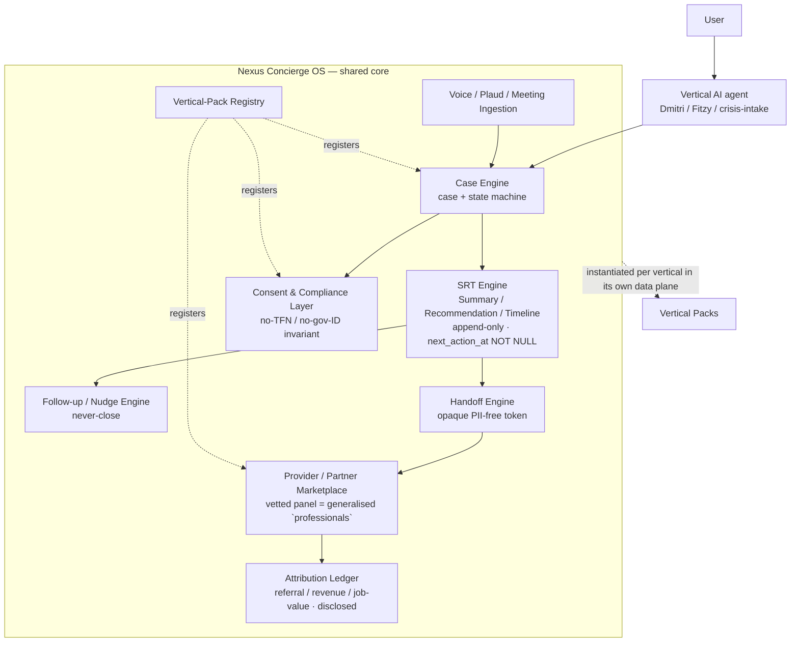

# Nexus Concierge OS — Core Case Engine + Universal SRT Engine (build-ready spec)

> This issue (UNI-2170) owns the **reusable core only**. Vertical-specific detail stays in
> each vertical's own project (UNI-2171 Lodgey, RA-6812 RestoreAssist, …). Core ≠ vertical.

## 1. Finish line

A single, versioned architecture that any Unite-Group vertical can instantiate to run a
"concierge" — an AI-fronted intake that opens a **case**, produces **SRTs** (Summary /
Recommendation / Timeline), hands off to a vetted **provider panel** under disclosed
referral terms, and never lets a case go dark (perpetual follow-up). Done when: the core
engines, data model, case states, SRT schema, consent/handoff/revenue rules, and a
vertical-pack registry are specified precisely enough that Lodgey and RestoreAssist (the
first two validation verticals) can each be built as a *pack* on top without changing the
core. `[VERIFIED]` scope mirrors UNI-2170 Required outputs.

## 2. Decision up front

**Nexus Concierge OS is an architecture pattern + shared engine spec, NOT one shared
database.** Each vertical instantiates the core in its own data plane and inherits the same
engines, states, and invariants. `[INFERENCE]` — forced by an existing hard boundary: Lodgey
runs on its **own Supabase project in AU-Sydney with no `founder_id` scoping**, explicitly
NOT the Nexus CRM (`duncan-itr-button/spec.md:24-28`) `[VERIFIED]`. A single-DB "OS" would
violate that boundary. The core is therefore delivered as (a) this spec, (b) a shared schema
migration template, and (c) a vertical-pack registry each vertical fills in.

**The SRT is the spine and it already exists — reuse, do not redefine.** `[VERIFIED]`
(`duncan-itr-button/spec.md:43,58,77`).

## 3. Goals & non-goals

**Goals**
- One universal **case engine** (container + state machine) every vertical maps onto.
- Promote the **SRT engine** from Lodgey-specific artefact to shared core, unchanged in meaning.
- A **consent & compliance layer** carrying the no-TFN/no-government-ID invariant as core.
- A **provider/partner marketplace** generalising Lodgey's vetted `professionals` panel +
  `referral_ledger` disclosure — not a parallel model.
- **Handoff & follow-up engine** (SRT-driven, never-close) and **attribution** (referral /
  revenue / job-value).
- **Voice / Plaud / meeting-intelligence ingestion** into cases + SRTs.
- A **vertical-pack registry** describing how a vertical plugs in.

**Non-goals** (REQUIRED)
- **NOT** a single shared Nexus tenant DB for all verticals (see §2). `[VERIFIED]` boundary.
- **NOT** building any vertical pack here — Lodgey/RA/CCW/CARSI/ATIA/DR are notes only (§ packs).
- **NOT** lodging or transacting with any government system (ATO etc.); concierge *guides*,
  never *lodges* — inherited from the Lodgey invariant. `[VERIFIED]` (`duncan-itr-button/spec.md:55-60`).
- **NOT** re-defining SRT, the professional-panel, or the no-TFN rule — all pre-existing.
- **NOT** DR-NRPG *code* (Windows-hosted, out of this Mac's scope) — its vertical note only.

## 4. Approach (plain language first)

A vertical's AI agent (Dmitri for Lodgey-ITR, Fitzy for DIY-home-loan, a crisis-intake bot
for RestoreAssist) greets a user and opens a **case**. As it learns, it appends **SRTs** —
each an append-only Summary + Recommendation + dated Timeline with `next_action_at NOT NULL`
so the case can never close silently. When the case needs a human, the handoff engine routes
it to a vetted **provider** on the vertical's panel via an **opaque, PII-free token** (the
existing `broker_handoffs`/SRT-style pattern, `duncan-diy-home-loan/spec.md:102` `[VERIFIED]`).
Referrals are logged with disclosure in an attribution ledger. Voice/Plaud/meeting audio is
ingested, transcribed, and folded into the case as SRTs. Each vertical registers itself in
the **vertical-pack registry** with its domain-to-case mapping, its knowledge base, its
provider panel, and its compliance regime.

### Core architecture (Mermaid — UNI-2170 required output)

**Engine responsibilities**
- **Case engine** — owns the `case` container + state machine (§6). Vertical-agnostic.
- **SRT engine** — the existing SRT artefact (§6), promoted to core, unchanged in semantics.
- **Consent & compliance layer** — records consent grants + enforces the no-TFN/no-ID
  invariant; each pack declares its regulatory regime. `[INFERENCE]` from Lodgey pattern.
- **Provider marketplace** — panel of vetted providers (generalises `professionals` incl.
  `tpb_registration_ref`-style credential fields) + disclosed `referral_ledger`. `[VERIFIED]`.
- **Handoff engine** — mints an opaque, PII-free token to route a case to a provider.
- **Follow-up/nudge engine** — the calendar nudge loop enforcing never-close. `[VERIFIED]`
  (Noah "circular perpetual concierge", `duncan-itr-button/spec.md:77`).
- **Attribution ledger** — referral/revenue/job-value with a `disclosed` flag. `[VERIFIED]`.
- **Ingestion** — voice/Plaud/meeting → transcript → SRT append. `[INFERENCE]`.
- **Vertical-pack registry** — a manifest per vertical (§6 `vertical_pack`).

## 5. Phased plan (smallest first)

- **Phase 0 — Ratify core contracts.** Lock the SRT reuse, case states, and the no-TFN
  invariant as core. **DoD:** this spec approved by Phill (`needs-phill-signoff`).
- **Phase 1 — Shared schema template.** Author the migration template for `case`, `srt`,
  `srt_return`, `consent`, `provider`, `handoff`, `referral_ledger`, `nudge`,
  `vertical_pack`. **DoD:** template migration file lands + reviewed; no vertical wired.
- **Phase 2 — Lodgey pack (UNI-2171).** First instantiation on Lodgey's existing Supabase;
  proves the core against a live SRT-native vertical. **DoD:** Lodgey maps onto core with
  zero core changes.
- **Phase 3 — RestoreAssist pack (RA-6812).** Second validation vertical (crisis-flow →
  case). **DoD:** RA maps onto core; two verticals share one core.
- **Phase 4 — Secondary verticals (CCW, CARSI, ATIA/trades, DR-NRPG).** Notes only here.

## 6. Data model

Branch-first, additive; each vertical owns its instance of these tables in its own data
plane. Table of the **core** entities (columns are the minimum contract, not exhaustive):

| Table | Purpose | Key columns |
|---|---|---|
| `case` | universal container | `id`, `vertical_pack_id`, `state` (§ states), `opened_at`, `next_action_at NOT NULL`, `closed_at NULL` |
| `srt` | Summary/Recommendation/Timeline, append-only, TFN/ID-free | `id`, `case_id`, `summary`, `recommendation`, `timeline`, `state` (open→action_dated→srt_returned→rolled_forward), `next_action_at NOT NULL`, `created_at` |
| `srt_return` | bidirectional return-SRT obligation | `id`, `srt_id`, `provider_id`, `body`, `returned_at` |
| `consent` | consent grants + scope | `id`, `case_id`, `scope`, `granted_at`, `revoked_at NULL`, `regime` |
| `provider` | vetted panel member (generalises `professionals`) | `id`, `vertical_pack_id`, `credential_ref`, `verified_at`, `active` |
| `handoff` | PII-free routing token | `id`, `case_id`, `provider_id`, `opaque_token`, `carries_pii=false`, `created_at` |
| `referral_ledger` | attribution, disclosed | `id`, `case_id`, `provider_id`, `kind` (referral\|revenue\|job_value), `amount`, `disclosed bool`, `created_at` |
| `nudge` | follow-up/never-close loop | `id`, `case_id`, `due_at`, `sent_at NULL`, `channel` |
| `vertical_pack` | registry manifest | `id`, `slug`, `domain_map`, `kb_ref`, `panel_ref`, `regime`, `data_plane` |

`[VERIFIED]` `srt`, `provider`, `referral_ledger`, `srt_return` shapes derive from
`duncan-itr-button/spec.md:122-135`; `handoff` from `duncan-diy-home-loan/spec.md:102`.
`case`, `consent`, `vertical_pack` are net-new core `[INFERENCE]` (no prior definition found).

### Case states

`intake → open → action_dated → awaiting_provider → provider_returned → rolled_forward`
(and terminal `closed` only via explicit close, never silent). `[INFERENCE]` — mirrors the
verified SRT state machine `open → action_dated → srt_returned → rolled_forward`
(`duncan-itr-button/spec.md`), lifted to the case level. `next_action_at NOT NULL` is the
never-close invariant `[VERIFIED]`.

### SRT schema — REUSED, not redefined

SRT = a **Summary**, a **Recommendation**, and a **Timeline**; append-only; carries **no TFN
or government ID**; state machine `open → action_dated → srt_returned → rolled_forward`;
`next_action_at NOT NULL` (never-close); bidirectional (a handed-off SRT demands a
return-SRT). `[VERIFIED]` verbatim from `duncan-itr-button/spec.md:43,58,77`. The core adopts
this definition unchanged; it merely stops being Lodgey-private.

## 7. Security & cost guardrails

- **No-TFN / no-government-ID invariant (CORE):** no route, table, log, or AI prompt may
  persist a TFN or government ID, in any vertical. `[VERIFIED]` established pattern
  (`duncan-itr-button/spec.md:120,142`, `duncan-diy-home-loan/spec.md:87`).
- **PII-free handoffs:** provider routing uses an opaque token only. `[VERIFIED]`.
- **Disclosed referrals:** every `referral_ledger` row records `disclosed` — inherited from
  ACL s18 / referral-disclosure framing in the Lodgey spec. `[VERIFIED]` (named), regime text
  `[UNCONFIRMED]` (R1).
- **Data-plane isolation:** each vertical's data stays in its own project; the OS is shared
  code+spec, not shared data. `[INFERENCE]` (§2).
- **Human-in-the-loop always; single-user/private/low-cost** — repo-wide Fable board rules.
  `[VERIFIED]` (`apps/spec-board/CLAUDE.md:55-59`).

## 8. Risk & assumption register

| # | Risk / assumption | Evidence | Mitigation |
|---|---|---|---|
| R1 | Regulatory regimes (TASA/TPB, AML/CTF, Privacy TFN Rule, ACL, ASIC RG246) named but primary text not fetched | `[UNCONFIRMED]` | per-pack Phase-0 legal map before that pack ships |
| R2 | "Provider marketplace" could drift into a parallel model vs existing `professionals` | `[VERIFIED]` panel exists | spec mandates generalise-not-duplicate (§4) |
| R3 | Shared-core coupling could leak a vertical's PII across data planes | `[INFERENCE]` | data-plane isolation invariant (§7); PII-free tokens |
| R4 | **ATIA acronym is trademark-contested** (AFTA holds live ATIA marks incl. class 41 education) | `[VERIFIED]` (`atia-brand-ops-2026-05-14.md:41-43`) | ATIA pack blocked on a naming/TM decision before build |
| R5 | RestoreAssist has no formal case schema today (content→lead→CRM→dispatch) | `[VERIFIED]` (`production-readiness-loop.md`) | RA pack must define its case mapping in Phase 3 |

## 9. Open questions (≤5)

1. Does any vertical need a *shared* provider panel across packs, or is each panel pack-local? (default: pack-local) `[UNCONFIRMED]`
2. Where does meeting/Plaud ingestion run per data-plane (edge fn vs external worker)? `[UNCONFIRMED]`
3. Is `vertical_pack.domain_map` a DB row or a checked-in manifest file? (lean: checked-in) `[UNCONFIRMED]`
4. ATIA naming — proceed under a different mark, or park the pack? (R4) `[UNCONFIRMED]`
5. Do CCW/CARSI (Nexus-CRM-tenant) share the CRM data plane or get isolated projects like Lodgey? `[UNCONFIRMED]`

## 10. Verification plan

- **Evidence-tag integrity:** every claim line carries `[VERIFIED]` / `[INFERENCE]` /
  `[UNCONFIRMED]`; `[UNCONFIRMED]` items all appear in §8 or §9.
  `grep -nE '\[(VERIFIED|INFERENCE|UNCONFIRMED)\]' spec.md` returns a tag per claim. `[VERIFIED]` method.
- **Core-vs-vertical separation:** grep confirms no vertical-specific table/route defined here
  (only notes). 
- **SRT non-redefinition:** the SRT schema section quotes the existing definition and adds
  nothing semantic — cross-check against `duncan-itr-button/spec.md:43,58,77`.
- **Gate compliance:** PR passes the RA-6815 validation & commit gate (branch, CI green,
  evidence comment to UNI-2170). `[VERIFIED]` gate exists (Pi-Dev-Ops #431 merged).

---

## Vertical-pack notes (context only — each is its own issue)

- **Lodgey** (UNI-2171, first validation vertical) — product family (Dmitri ITR-intake, Noah
  post-NOA referral, Fitzy DIY-home-loan). SRT-native, no-TFN, own Supabase (AU-Sydney, no
  `founder_id`). Maps 1:1 onto the core (it *is* where the core patterns came from).
  `[VERIFIED]` (`duncan-itr-button/spec.md`, `duncan-diy-home-loan/spec.md`).
- **RestoreAssist** (RA-6812, second validation vertical) — restoration/disaster-recovery
  concierge; today content→lead→Unite-Hub CRM→contractor dispatch with a "crisis flow", no
  formal case schema. Pack must define crisis-intake → `case`. `[VERIFIED]`
  (`production-readiness-loop.md`).
- **CCW** — carpet-cleaning Brisbane; live client portal + custom CRM. Case = cleaning job;
  provider panel = operators. Nexus-CRM-tenant data plane (R5). `[VERIFIED]`
  (`au-nz-market-dominance-architecture.md:78`).
- **CARSI** — carpet/restoration certification & standards body. Likely a *provider-panel /
  credentialing* source rather than a case-owning vertical. `[VERIFIED]` (same doc :77).
- **ATIA / trades** — Australian Trade Industry Association (standards body). **Blocked on a
  trademark decision** (R4). Case = trade-standards enquiry; panel = member trades.
  `[VERIFIED]` (`atia-brand-ops-2026-05-14.md`).
- **DR-NRPG** — NRPG = disaster-recovery contractor network (directory + verification,
  $49–99/mo); DR = the disaster-recovery brand. Pack = contractor onboarding/lead routing;
  code is Windows-hosted (out of this scope) — note only. `[VERIFIED]`
  (`au-nz-market-dominance-architecture.md:61-70`).

[STATUS] gate: awaiting approval — Phill sign-off required (`needs-phill-signoff`).
