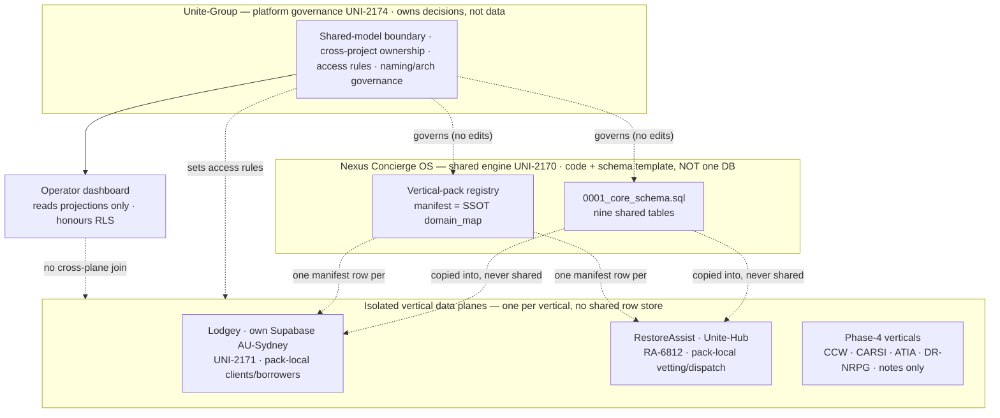

# Unite-Group — Platform Alignment: Shared Model & Governance (build-ready spec)

> This issue (UNI-2174) owns **platform-level alignment only**: how Unite-Group sits *above*
> the Nexus Concierge OS core (UNI-2170) and its verticals (Lodgey UNI-2171, RestoreAssist
> RA-6812) as the shared-platform pattern owner. Unite-Group owns platform decisions,
> workspace/tenant boundaries, shared customer/contact and partner/provider **concepts**,
> consent/audit patterns, operator-dashboard conventions, cross-project access rules, and
> shared naming/architecture governance. It owns **no vertical workflow** — those stay inside
> the vertical projects. `[VERIFIED]` scope mirrors UNI-2174 Purpose + Scope.

## 1. Finish line

A single governance note that fixes the boundary between **Unite-Group (the platform)** and
**Nexus Concierge OS (the shared engine) + its verticals**, precisely enough that: (a) every
shared concept — customer/contact, partner/provider, workspace/tenant, consent, audit — has an
owner and a stated "shared vs vertical-local" disposition; (b) every project's ownership and
cross-project access is mapped; (c) the integration surface back to the core is named so a
vertical or a future platform team knows what it may reuse and what it may not touch. Done when
the four UNI-2174 required outputs exist — (1) alignment note (§2–§5), (2) shared-model
boundary list (§6), (3) cross-project ownership map (§7), (4) integration notes back to Nexus
Concierge OS (§8) — the three in-scope core open questions (§9 OQ1/OQ3/OQ5) are answered or
explicitly carried, and the data-plane-isolation invariant is restated as a platform rule.
`[VERIFIED]` scope mirrors UNI-2174 Required outputs + Acceptance criteria.

## 2. Decision up front

**Unite-Group is a governance layer over the shared pattern, not a new runtime and not a new
database.** `[INFERENCE]` — forced by the core's own founding decision: Nexus Concierge OS is
"an architecture pattern + shared engine spec, NOT one shared database", each vertical in its
own data plane (`nexus-concierge-os/spec.md:36-42`) `[VERIFIED]`. A platform layer that
introduced a shared runtime or a shared tenant DB would re-open the exact boundary the core
closed. Unite-Group therefore delivers **decisions and conventions**, expressed as this note
plus the already-checked-in artefacts it governs (the schema template, the registry), and adds
**no** new tables, app code, or data plane of its own.

**"Shared" at the platform level means a shared *definition*, not shared *data*.** The core
already draws this line — the SRT, `provider`, and the no-TFN invariant are shared **concepts**
reused verbatim by each vertical in its own plane, never a shared row store
(`nexus-concierge-os/spec.md:44-45,178-186`) `[VERIFIED]`. Unite-Group's job is to hold that
line for the *next* concepts a platform is tempted to centralise — customer/contact and
partner/provider — and to say explicitly where each lives (§6).

**Unite-Hub is a vertical's data plane, not the platform.** The AU/NZ architecture names
Unite-Hub CRM as the "central nervous system" for leads/pipeline
(`au-nz-market-dominance-architecture.md:41-47`) `[VERIFIED]`, and RestoreAssist's pack runs
**in** `CleanExpo/Unite-Hub` as its isolated data plane
(`restoreassist-pack/spec.md:43-48`, `registry/restoreassist.json`) `[VERIFIED]`. Platform
alignment must not conflate "Unite-Hub the CRM/data-plane" with "Unite-Group the platform
governance layer": the former is a place data lives; the latter owns no data. `[INFERENCE]`
from those two verified facts.

## 3. Goals & non-goals

**Goals**
- Ratify **data-plane isolation** as a standing *platform* invariant, not just a core §7 line —
  every vertical keeps its own data plane; the platform owns no shared row store. `[VERIFIED]`
  (`nexus-concierge-os/spec.md:36-42,185-186`).
- Fix the **shared customer/contact concept** disposition: a customer/contact is a
  **vertical-local, minimal-PII, no-TFN/gov-ID** record; the platform standardises its *shape
  and rules*, not a shared table. `[INFERENCE]` from the core no-TFN invariant + the packs'
  pack-local `clients`/`borrowers` records (`nexus-concierge-os/spec.md:178-180`,
  `lodgey-pack/spec.md:146-148`).
- Fix the **shared partner/provider concept** disposition: `provider` is a **shared core
  table** (already in the template) instantiated per-vertical; a *shared* panel across
  verticals is a governed exception, default off (answers core OQ1, §9). `[VERIFIED]`
  (`0001_core_schema.sql:58-65`; core OQ1 `nexus-concierge-os/spec.md:202`).
- State the **consent & audit** pattern: `consent` is a shared core table per-vertical;
  disclosed `referral_ledger` + explicit-close `case`/`srt` are the platform's audit spine;
  per-vertical regime text stays `named_unconfirmed` until legal sign-off. `[VERIFIED]`
  (`0001_core_schema.sql:108-116,129-138`; `registry/README.md` `regime_status`).
- Set **operator-dashboard conventions**: any cross-vertical operator view reads *projections*
  of vertical data, honouring RLS/data-plane isolation — never a direct cross-plane join.
  `[INFERENCE]` from data-plane isolation + Command-Center "portfolio health" role
  (`au-nz-market-dominance-architecture.md:106-118`).
- Publish **cross-project access rules** and a **cross-project ownership map** (§7) so a change
  to a shared concept has one owner (Unite-Group) and every vertical knows its blast radius.
- Lock **shared naming & architecture governance**: the registry manifest is the SSOT for a
  vertical's `domain_map` (answers core OQ3, §9); a core change is a UNI-2170 issue, never a
  pack workaround (the packs' standing rule, raised to platform law). `[VERIFIED]`
  (`registry/README.md`; `lodgey-pack/spec.md:75-77`, `restoreassist-pack/spec.md:80-82`).

**Non-goals** (REQUIRED)
- **NOT** editing the core spec, the core schema template, the registry manifests, or any
  vertical pack — if platform alignment implies a core change, that is a **UNI-2170** issue;
  this note *governs*, it does not *modify*. `[VERIFIED]` boundary (core DoD
  `nexus-concierge-os/spec.md:134,137`).
- **NOT** defining or building any **vertical workflow** (intake, dispatch, quarterly review,
  crisis flow) — those live in the vertical projects. `[VERIFIED]` UNI-2174 acceptance
  criterion ("vertical workflows stay inside vertical projects").
- **NOT** introducing a **shared tenant DB, a platform runtime, or platform app code** — the
  core's founding non-goal, inherited (`nexus-concierge-os/spec.md:61`). `[VERIFIED]`.
- **NOT** re-defining SRT, `provider`, the case states, the no-TFN rule, or the PII-free
  handoff — all pre-existing core concepts the platform *governs*, not restates.
  `[VERIFIED]` (core §Non-goals `nexus-concierge-os/spec.md:65`).
- **NOT** resolving any vertical's regime primary-text (each pack's R1) — the platform sets the
  `named_unconfirmed → signed` *process*, not the legal opinion. `[VERIFIED]`
  (`registry/README.md`).

## 4. Approach (plain language first)

Nexus Concierge OS gave every Unite-Group vertical the same spine — a `case`, append-only
`srt`s, a vetted `provider` panel, PII-free `handoff`s, disclosed referrals, and a never-close
follow-up loop — and drew one hard line: **the OS is shared code + schema, never shared data**;
each vertical runs the same nine tables in *its own* Supabase project (Lodgey in AU-Sydney,
RestoreAssist in Unite-Hub). Unite-Group is the layer that *keeps* that line honest as the
portfolio grows. It answers the questions a vertical can't answer alone: *Is the customer record
shared? Is the provider panel shared across verticals? Who owns a change to the schema template?
Where does an operator dashboard get to read across verticals — and where must it stop?* The
answers are conservative by design: **customer/contact stays vertical-local** (minimal-PII,
no-TFN, RLS-scoped in each plane); **`provider` is a shared table but a pack-local panel by
default** (a cross-vertical panel is an explicit, governed exception); **`consent` is a shared
table per vertical**, and disclosed `referral_ledger` + explicit-close cases are the audit
spine; **operator dashboards read projections, never cross-plane joins**; and **the registry
manifest is the single source of truth** for how each vertical plugs in. Unite-Group writes
none of this into a database and builds no app — it *governs* the artefacts the core already
checked in, and routes any change that would touch the core back to UNI-2170.

### Platform-over-core boundary (Mermaid — UNI-2174 alignment view)

## 5. Phased plan (smallest first)

- **Phase 0 — Ratify the alignment (this note).** Lock §6 boundary list, §7 ownership map, §8
  integration notes, and the OQ1/OQ3/OQ5 answers. **DoD:** this note approved by Phill
  (`needs-phill-signoff`); gate evidence comment posted to UNI-2174. `[VERIFIED]` gate exists
  (`nexus-concierge-os/spec.md:218`).
- **Phase 1 — Publish the governance surface.** No new artefacts required — the schema template
  and registry already exist; this note *points at* them as the governed surface. **DoD:** every
  shared concept in §6 resolves to an existing core artefact or a stated vertical-local
  disposition; no new platform table/app introduced. `[VERIFIED]` method (grep §6 rows against
  the checked-in template + manifests).
- **Phase 2 — Enforce on the next vertical.** When a Phase-4 vertical (CCW/CARSI/ATIA/DR-NRPG)
  is scoped, it must (a) file its own pack + registry manifest, (b) declare its data plane
  (shared Nexus-CRM tenant vs isolated project — core OQ5, §9), (c) take zero core edits.
  **DoD:** the ownership map (§7) is the checklist a new pack is reviewed against. `[VERIFIED]`
  (core Phase-4 notes `nexus-concierge-os/spec.md:137,222-243`).

## 6. Shared-model boundary list (UNI-2174 required output #2)

The platform's core deliverable: for every shared concept, **who owns it** and whether it is
**shared (one definition, reused) or shared-table-per-vertical (instantiated in each plane) or
vertical-local (each vertical defines its own)** — never "shared data across verticals".

| Shared concept | Disposition | Owner | Rule / evidence |
|---|---|---|---|
| **Data-plane isolation** | Platform invariant | Unite-Group | Every vertical keeps its own data plane; no shared row store; the OS is code+schema only. `[VERIFIED]` (`nexus-concierge-os/spec.md:36-42,185-186`) |
| **Customer / contact** | **Vertical-local** | Vertical pack | A customer/contact is a pack-local, minimal-PII, **no-TFN/no-gov-ID**, RLS-scoped record in the vertical's plane; the platform standardises the *shape + rules*, not a shared table. `[INFERENCE]` from no-TFN invariant + pack-local `clients`/`borrowers` (`nexus-concierge-os/spec.md:178-180`; `lodgey-pack/spec.md:146-148`) |
| **Partner / provider (table)** | **Shared core table, per-vertical instance** | Core (UNI-2170) | `provider` is one of the nine core tables; each vertical instantiates it in its own plane, adding pack columns only. `[VERIFIED]` (`0001_core_schema.sql:58-65`; `lodgey-pack/spec.md:138`, `restoreassist-pack/spec.md:144`) |
| **Partner / provider (panel)** | **Pack-local by default; shared = governed exception** | Unite-Group (exception owner) | Default: each vertical's panel is pack-local (answers core OQ1, §9). A cross-vertical shared panel (e.g. CARSI credentialing feeding others) is an explicit platform decision, off until made. `[VERIFIED]` (core OQ1 `nexus-concierge-os/spec.md:202`; CARSI-as-credentialing `nexus-concierge-os/spec.md:236`) |
| **Consent** | **Shared core table, per-vertical instance** | Core (UNI-2170) | `consent` is core; each vertical records grants + `regime` in its own plane; regime primary text stays `named_unconfirmed` until legal sign-off. `[VERIFIED]` (`0001_core_schema.sql:108-116`; `registry/README.md`) |
| **Audit spine** | **Shared pattern** | Unite-Group | The platform's audit surface = disclosed `referral_ledger` (every row records `disclosed`) + explicit-close `case`/`srt` (never-close: `next_action_at NOT NULL`, close only via deliberate `closed_at`). No silent state change. `[VERIFIED]` (`0001_core_schema.sql:15-29,129-138`) |
| **Workspace / tenant boundary** | **Vertical-local, platform-governed** | Unite-Group | Each vertical is a tenant boundary = its data plane; RLS is deny-all by default in the template, each vertical adds its own isolation policies before any client access. `[VERIFIED]` (`migrations/README.md` RLS; `0001_core_schema.sql:162-173`) |
| **`vertical_pack` manifest / domain_map** | **Shared registry, checked-in SSOT** | Unite-Group (registry owner) | The checked-in `<slug>.json` manifest is the source of truth; the DB row is a projection of it (answers core OQ3, §9). `[VERIFIED]` (`registry/README.md` "OQ3 — resolved: checked-in") |
| **SRT / case states / no-TFN / PII-free handoff** | **Shared concept, reused verbatim** | Core (UNI-2170) | Pre-existing core invariants; the platform governs adherence, never redefinition. `[VERIFIED]` (`nexus-concierge-os/spec.md:65,168-186`) |

**The one platform rule that generates the rest:** *shared means a shared definition, never
shared data.* Any proposal to centralise a concept into one cross-vertical store must first
clear this rule and the data-plane-isolation invariant. `[INFERENCE]` from §2 + the core
founding decision.

## 7. Cross-project ownership map (UNI-2174 required output #3)

Who owns what, and who may touch what. **Access rule (platform law):** a project may **read
its own plane**; a *core* change is filed as **UNI-2170**, never made inside a pack; a
cross-vertical read is a **projection**, never a cross-plane join.

| Project | Issue | Owns | May change | Must NOT change | Data plane |
|---|---|---|---|---|---|
| **Unite-Group (platform)** | UNI-2174 | Shared-model boundary, ownership map, access rules, naming/arch governance, operator-dashboard conventions | This note; the *decision* about whether a concept is shared/vertical-local | The core spec, schema template, registry manifests, any pack (those are their own issues) | none — owns no data |
| **Nexus Concierge OS (core)** | UNI-2170 | The nine shared tables, case states, SRT, invariants, registry mechanism | The core schema template + core spec (via UNI-2170 PRs only) | Any vertical's pack-local tables or data | none — template only, not a live DB |
| **Lodgey pack** | UNI-2171 | Dmitri/Noah/Fitzy mapping onto core; pack-local `clients`/`borrowers`/`payments`/`facilities`/… | Its own pack spec + its own Supabase plane | The core contract (→ file UNI-2170); other verticals' planes | own Supabase, AU-Sydney, no `founder_id`, RLS per `client_slug`/`professional_id` `[VERIFIED]` (`registry/lodgey.json`) |
| **RestoreAssist pack** | RA-6812 | Crisis-intake→case mapping; safety gates as pack-local guards; pack-local vetting/dispatch/comms tables | Its own pack spec + its Unite-Hub plane | The core contract; PII in a `handoff` row (address is post-accept, pack-local) | `CleanExpo/Unite-Hub`, AU, RLS per case/provider, **not** the Nexus CRM `[VERIFIED]` (`registry/restoreassist.json`) |
| **Phase-4 verticals (CCW, CARSI, ATIA, DR-NRPG)** | TBD (own issues) | notes only until scoped; each becomes its own pack + manifest | — | — | per-vertical; shared-Nexus-CRM-tenant vs isolated is core OQ5 (§9) `[VERIFIED]` (`nexus-concierge-os/spec.md:222-243`) |

**Escalation path (platform-owned):** a vertical that needs a core column raises **UNI-2170**;
a vertical that needs a shared cross-vertical concept (shared panel, shared commerce) raises
**UNI-2174** (this platform layer decides shared-vs-local); a vertical that needs neither builds
in its own pack + plane. `[INFERENCE]` from the packs' "core change = core issue" rule raised to
a routing rule (`lodgey-pack/spec.md:75-77`, `restoreassist-pack/spec.md:80-82`).

## 8. Integration notes back to Nexus Concierge OS (UNI-2174 required output #4)

What the platform hands *back* to the core team, and the seams between them.

1. **No core edits land here.** This alignment ratifies the core as-is; the correct
   `git diff main -- apps/spec-board/projects/nexus-concierge-os/` for this PR is **empty**.
   The platform's contribution is a governance note beside the core, not a change to it.
   `[VERIFIED]` method (mirrors the packs' zero-core-change DoD
   `lodgey-pack/spec.md:217-218`).
2. **Three core open questions are resolved or carried at platform level** (details §9):
   **OQ1** (shared vs pack-local provider panel) → **answered: pack-local by default**, shared
   is a governed exception owned by UNI-2174. **OQ3** (`domain_map` DB row vs checked-in
   manifest) → **answered: checked-in manifest is SSOT**, already resolved by the registry;
   the platform ratifies it as naming/arch law. **OQ5** (do CCW/CARSI share the Nexus-CRM data
   plane or get isolated projects) → **carried** as a Phase-4 per-vertical decision the platform
   will make when each is scoped, defaulting to isolation. `[VERIFIED]` (core OQ1/OQ3/OQ5
   `nexus-concierge-os/spec.md:202,204,206`; registry OQ3 resolution `registry/README.md`).
3. **The data-plane-isolation invariant is promoted to a platform invariant.** Core §7 states
   it; UNI-2174 restates it as standing platform law so no future platform feature (operator
   dashboard, shared analytics, cross-vertical search) may introduce a shared row store or a
   cross-plane join. Operator dashboards read **projections** only. `[VERIFIED]` (core §7
   `nexus-concierge-os/spec.md:185-186`).
4. **The registry is the integration seam.** A new vertical integrates by filing a
   `<slug>.json` manifest (field contract in `registry/README.md`) and copying the schema
   template into its own plane — it does **not** hand-author `domain_map` in a DB or edit the
   template. `[VERIFIED]` (`registry/README.md`).
5. **`regime_status` lifecycle is a shared governance gate.** Every vertical's regime stays
   `named_unconfirmed` until Lens + a lawyer sign it; the platform owns that lifecycle label as
   a cross-vertical convention, not the legal opinion itself (each pack's R1). `[VERIFIED]`
   (`registry/README.md`; core R1 `nexus-concierge-os/spec.md:194`).
6. **Open governance seam for the core team:** if a second vertical genuinely needs a *shared*
   concept the core doesn't have (shared provider panel, shared commerce/`payments`), that is a
   **core** proposal (new shared table) *plus* a **platform** decision (is it shared or
   vertical-local) — the two issues move together, core owns the schema, platform owns the
   shared-vs-local call. `[INFERENCE]` from Lodgey OQ2 (pack-local commerce) +
   RestoreAssist OQ4 (RA-local panel) both leaning local (`lodgey-pack/spec.md:210`,
   `restoreassist-pack/spec.md:221`).

## 9. Open questions (≤5)

Core §9 OQ1, OQ3, OQ5 are in scope for this alignment and are dispositioned here; the remaining
platform-level questions are listed below.

1. **[core OQ1 — ANSWERED]** Shared provider panel across packs, or pack-local? → **Pack-local
   by default.** A cross-vertical shared panel (e.g. CARSI credentialing feeding other verticals)
   is a governed exception, owned by UNI-2174, and off until explicitly decided. `[VERIFIED]`
   basis (core OQ1 `nexus-concierge-os/spec.md:202`; CARSI-as-credentialing :236).
2. **[core OQ3 — ANSWERED]** Is `vertical_pack.domain_map` a DB row or a checked-in manifest? →
   **Checked-in manifest is the SSOT**, DB row is a projection — already resolved by the
   registry; the platform ratifies it as naming/architecture law. `[VERIFIED]`
   (`registry/README.md`).
3. **[core OQ5 — CARRIED]** Do CCW/CARSI (Nexus-CRM-tenant) share the CRM data plane or get
   isolated projects like Lodgey? → **Carried** as a Phase-4 per-vertical decision, defaulting
   to isolation; the platform decides when each is scoped. `[UNCONFIRMED]` (`nexus-concierge-os/spec.md:206`).
4. Does a cross-vertical **operator dashboard** ever need more than read-only projections (e.g.
   a write-back that would cross planes)? (lean: no — projections only; a write is a
   vertical-plane action.) `[UNCONFIRMED]`
5. When a second vertical needs **shared commerce** (`payments`/refunds), does it become a new
   *shared core* table or stay pack-local per vertical? (lean: pack-local until ≥2 verticals
   demonstrably need one shape; inherits Lodgey OQ2 + RestoreAssist §6.) `[UNCONFIRMED]`

## 10. Verification plan

- **Zero core / pack changes (the DoD):**
  `git diff main -- apps/spec-board/projects/nexus-concierge-os/ apps/spec-board/projects/lodgey-pack/ apps/spec-board/projects/restoreassist-pack/`
  returns empty for this PR; the only added path is
  `apps/spec-board/projects/unite-group-platform-alignment/`. `[VERIFIED]` method.
- **Four required outputs present:** §2–§5 (alignment note), §6 (shared-model boundary list),
  §7 (cross-project ownership map), §8 (integration notes back to core) — one section each.
  `[VERIFIED]` method.
- **In-scope core OQs dispositioned:** OQ1/OQ3/OQ5 each appear in §8.2 and §9 with an
  ANSWERED/CARRIED verdict; grep `core OQ` in this file returns three. `[VERIFIED]` method.
- **Data-plane-isolation restated as platform law:** §6 (first row), §8.3, and the §4 diagram
  each carry it; no section proposes a shared row store or a cross-plane join. `[VERIFIED]` method.
- **Evidence-tag integrity:** every claim carries `[VERIFIED]`/`[INFERENCE]`/`[UNCONFIRMED]`;
  every `[UNCONFIRMED]` appears in §8/§9 or a register line.
  `grep -nE '\[(VERIFIED|INFERENCE|UNCONFIRMED)\]' spec.md`. `[VERIFIED]` method.
- **Gate compliance:** PR passes the RA-6815 validation & commit gate (branch, spec-board CI
  green, evidence comment to UNI-2174). `[VERIFIED]` gate exists (Pi-Dev-Ops #431 merged).

---

## Risk & assumption register

| # | Risk / assumption | Evidence | Mitigation |
|---|---|---|---|
| R1 | Regime primary text across verticals (TASA/TPB, Privacy Act/APP, PCI-DSS, ACL, AUSTRAC, …) named but not fetched; each vertical's `regime_status` is `named_unconfirmed` | `[UNCONFIRMED]` (inherited core R1 `nexus-concierge-os/spec.md:194`; `registry/README.md`) | platform owns the `named_unconfirmed → signed` lifecycle gate; no vertical ships its regime until Lens + a lawyer sign (§8.5) |
| R2 | "Unite-Hub the CRM/data-plane" could be conflated with "Unite-Group the platform layer", re-introducing a shared runtime by accident | `[VERIFIED]` two distinct things (`au-nz-market-dominance-architecture.md:41-47`; `restoreassist-pack/spec.md:43`) | §2 fixes the distinction; §6/§7 give Unite-Group no data plane at all |
| R3 | An operator dashboard is the most likely place data-plane isolation leaks (a cross-plane join for a "portfolio view") | `[INFERENCE]` (Command-Center portfolio role `au-nz-market-dominance-architecture.md:106-118`) | §6/§8.3 mandate projections only; OQ4 carries the write-back question |
| R4 | The platform could over-centralise (declare customer or provider-panel "shared data") under portfolio-view pressure | `[INFERENCE]` (the recurring temptation §2) | the one platform rule (§6) + data-plane-isolation invariant gate every centralisation proposal; default is vertical-local |
| R5 | Phase-4 verticals (CCW/CARSI/ATIA/DR-NRPG) may force a shared concept before the platform has a process for it | `[VERIFIED]` notes-only today (`nexus-concierge-os/spec.md:222-243`); ATIA also TM-blocked (core R4 :197) | §5 Phase 2 + §7 escalation path make the ownership map the review checklist for every new pack |

---

[STATUS] gate: awaiting approval — Phill sign-off required (`needs-phill-signoff`).
Aligns to merged core UNI-2170 (`nexus-concierge-os/spec.md`) and packs UNI-2171 / RA-6812.
Zero core changes, zero pack changes — governance note only.
