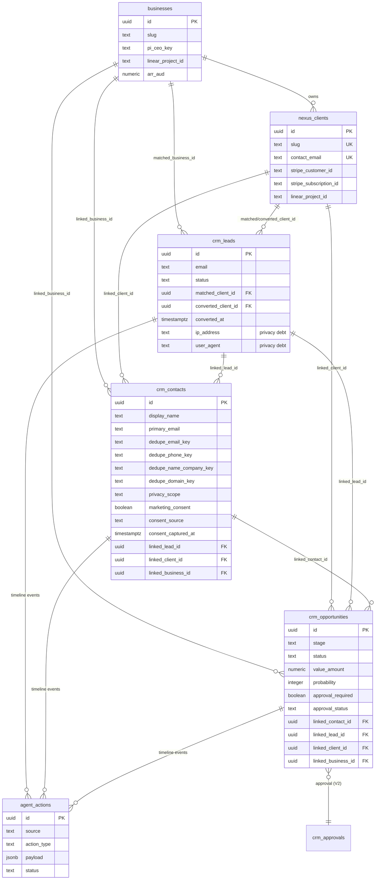
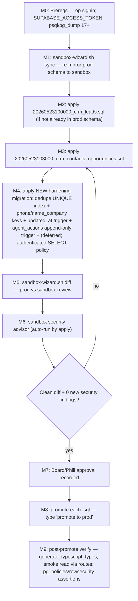

# Data Model & ERD — Authority-Site In-House CRM

> **Companion artifact to [`/spec.md`](../../spec.md) §6 (Domain & Data Architecture).** Full entity model, ERD, dedupe-key strategy, privacy scopes, RLS posture, and the sandbox-first migration plan for the V1 tables.
>
> **Source-of-truth law (locked):** Supabase = CRM truth; Stripe = billing truth; Linear = execution truth. CRM objects mirror but never overwrite the truth source.
>
> **Migration law (locked):** every schema change routes through `scripts/sandbox-wizard.sh` (sandbox `apply` → `diff` → `promote` with typed `promote to prod`). No direct `psql`, `supabase db push`, or MCP `apply_migration` against prod ref `lksfwktwtmyznckodsau`. Sandbox ref `xgqwfwqumliuguzhshwv` mirrors prod via `pg_dump --schema-only`.
>
> **Cross-links:** [spec.md](../../spec.md) · [feature-coverage-matrix.md](./feature-coverage-matrix.md) · [phase-plan.md](./phase-plan.md)
>
> **Evidence tags:** `[VERIFIED]` = read in the named file · `[INFERENCE]` = reasoned · `[UNCONFIRMED]` = could not verify.

---

## 1. Entity model overview

The CRM spine layers on the existing Nexus identity tables. Three identity anchors already exist in prod-applied migrations (`businesses`, `nexus_clients`, `agent_actions`); the CRM extends them rather than replacing them. There is **no separate `accounts`/`organizations` table in V1** — org identity is carried by `businesses` (portfolio operating units) and `nexus_clients` (paying clients); `crm_contacts.company_name` is a free-text label until a V2 `crm_accounts` table normalizes it. `[INFERENCE — grounded in the single-tenant lock and the existing businesses/nexus_clients split]`

| Entity | Status | Role | Migration |
|---|---|---|---|
| `businesses` | live | Portfolio operating units (org identity) | prod-applied (nexus_businesses) |
| `nexus_clients` | live | Paying clients (org identity, billing links) | prod-applied (nexus_clients) |
| `agent_actions` | live | Unified audit / activity timeline | `20260510000004_nexus_agent_actions.sql` `[VERIFIED]` |
| `crm_leads` | migration written, not applied from ops lane | Inbound lead capture | `20260523100000_crm_leads.sql` `[VERIFIED]` |
| `crm_contacts` | DRAFTED, not applied | Canonical people record | `20260523103000_crm_contacts_opportunities.sql` `[VERIFIED]` |
| `crm_opportunities` | DRAFTED, not applied | Pipeline / forecast (forecast-only, NOT billing truth) | `20260523103000_crm_contacts_opportunities.sql` `[VERIFIED]` |
| `crm_accounts` | not built | Normalized org entity | V2 |
| `crm_opportunity_line_items` | not built | Products/quotes on opportunities | V2 |
| `crm_approvals` | not built | Dedicated approval history/query store | V2 (Stage-2; V1 uses task-subtype model) |
| `activity_timeline` (dedicated) | not built | Typed timeline table | V3+ (only if `agent_actions` query/RLS limits are proven) |

---

## 2. ERD

### Verified relationship facts

- `crm_leads` references `nexus_clients(id)` via `matched_client_id` and `converted_client_id`, and `businesses(id)` via `matched_business_id`, all `ON DELETE SET NULL` — `supabase/migrations/20260523100000_crm_leads.sql:21-23`. `[VERIFIED]`
- `crm_contacts` links to `crm_leads`, `nexus_clients`, `businesses` via `linked_lead_id` / `linked_client_id` / `linked_business_id`, all `ON DELETE SET NULL` — `…103000.sql:15-17`. `[VERIFIED]`
- `crm_opportunities` links to lead, contact, client, business — `…103000.sql:91-94`; FK `linked_contact_id → crm_contacts(id)` at `…103000.sql:92` establishes the **apply-ordering constraint (contacts before opportunities)**. `[VERIFIED]`
- The unified timeline is carried by `agent_actions`, keyed by `action_type = 'crm_timeline_<event_type>'` with a sanitized `payload` — mapper `src/lib/crm/activity-timeline.ts:217-256`. `[VERIFIED]`

---

## 3. Dedupe keys & strategy (V1)

Dedupe is **detect-and-block on write** in V1 (no auto-merge — auto-merge is a high-risk approval subject, see §5). The migration declares four `dedupe_*` text columns but **adds no UNIQUE constraint/index** (`grep -ni unique …103000.sql` → none) `[VERIFIED gap]`, and the contacts route currently computes only `dedupe_email_key` + `dedupe_domain_key` (`src/app/api/crm/contacts/route.ts:261-262`) — `dedupe_phone_key` and `dedupe_name_company_key` are always null. `[VERIFIED gap]`

| Key | Derivation | Confidence | V1 enforcement |
|---|---|---|---|
| `dedupe_email_key` | `lower(trim(primary_email))` | **strong** | partial UNIQUE index + app pre-check (block-on-alone) |
| `dedupe_phone_key` | digits-only, last 10–12 normalized (E.164-ish) | medium | index + soft warn (collision → 409 only with email/name corroboration) |
| `dedupe_name_company_key` | `lower(trim(display_name)) \| lower(trim(company_name))` | weak | index + soft warn only |
| `dedupe_domain_key` | email domain | hint-only | index; **never** a dedupe trigger alone |

**Rules** (carry the operating-model identity policy, `docs/margot/crm-operating-model.md:116-137`): email is the only key strong enough to block on alone; domain is "a hint, not proof"; phone/name+company block only when a second key corroborates. App-layer behavior today: `existingContactConflictByEmail` returns `409 crm_contact_conflict` on email-key match; Postgres unique violation `23505` is also mapped to `409` (`…contacts/route.ts:284-285`). `[VERIFIED]`

**V1 hardening (NEW additive migration, sandbox-first):**
1. Add a **partial UNIQUE index** on `dedupe_email_key` (`WHERE dedupe_email_key IS NOT NULL`) so the DB is the authoritative backstop, closing the route-layer TOCTOU race.
2. Populate **all four** dedupe keys in the contacts route; back phone/name_company with indexes.
3. Add a `set_updated_at` **BEFORE UPDATE trigger** on `crm_contacts`/`crm_opportunities` (reuse the proven pattern in `supabase/migrations/20260514142500_client_approvals.sql`) — `updated_at` is currently only refreshed by app code. `[VERIFIED gap]`

---

## 4. Privacy scopes

`crm_contacts.privacy_scope` (CHECK ∈ `lead_scoped`, `client_scoped`, `business_scoped`, `restricted`, `global_crm`; `NOT NULL DEFAULT 'lead_scoped'`) is the per-record visibility band — `…103000.sql:39-41`. `[VERIFIED]` In single-tenant V1 every operator can read all scopes (RLS is service-role only); scopes are **forward-compatible metadata** that becomes load-bearing when V3+ granular RBAC arrives, and they drive redaction in surfaces today.

Privacy obligations carried into the data layer:
- **PII redaction in timeline** is enforced at write time (`src/lib/crm/activity-timeline.ts:105-153`) — strips email/phone/token/payment/board-ref patterns; the contacts route re-sanitizes the subject label (`…contacts/route.ts:65-85`). The unified timeline never persists raw PII even though contacts/leads do. `[VERIFIED]`
- **`crm_leads` IP/user-agent retention** is an unresolved privacy debt (raw `text`, no retention decision — `…crm_leads.sql:24-25`; flagged at `docs/margot/crm-operating-model.md:200`). Recommendation: hash/truncate on insert, set a retention window (30–90 days), document consent basis — or drop the columns. `[VERIFIED debt]`
- **Consent** is first-class on contacts (`marketing_consent`, `consent_source`, `consent_captured_at` — `…103000.sql:20-22`) and leads (`marketing_consent` — `…crm_leads.sql:15`), but the contacts route writes only `marketing_consent` today — `consent_source`/`consent_captured_at` are droppable and must be wired server-side whenever consent flips true. `[VERIFIED gap]`

---

## 5. RLS posture

**Current posture: every CRM truth table is RLS-enabled with a single `service_role` ALL policy and no authenticated/anon policy.** All reads/writes route through service-role server routes gated by `requireAdmin`. `[VERIFIED]`

| Table | RLS | Policies | Path |
|---|---|---|---|
| `crm_leads` | enabled | `service_role` ALL only | `…crm_leads.sql:44-63` |
| `crm_contacts` | enabled | `service_role` ALL only | `…103000.sql:59-78` |
| `crm_opportunities` | enabled | `service_role` ALL only | `…103000.sql:151-171` |
| `agent_actions` | enabled | `service_role` ALL **+ authenticated SELECT `USING(true)`** | `…nexus_agent_actions.sql:29-37` |
| `nexus_clients` | enabled | `service_role` ALL + authenticated SELECT | `…nexus_clients.sql:30-40` |
| `data_room_documents` | enabled | `service_role` ALL + founder-email SELECT | `…data_room_documents.sql:65-74` |

**V1 RLS plan:**
- Keep service-role-only writes on `crm_contacts`/`crm_opportunities`. The `service_role` ALL policy is the safety floor — no client-side write path is ever opened to CRM tables. `[INFERENCE — extends the verified existing pattern]`
- Add an **`authenticated` SELECT** policy to both **only once** the privacy-scope redaction story for client-scoped reads is confirmed; until then, reads stay service-role-routed. (Matches the existing `nexus_clients`/`agent_actions` pattern.)
- **Tighten `agent_actions` SELECT** to founder-email-only (mirror `data_room_documents`) before any second authenticated principal (V2 ops team) exists — today's `authenticated SELECT USING(true)` is over-broad read of the entire audit trail. `[VERIFIED gap — G-RLS-1]`
- Add a **BEFORE UPDATE OR DELETE trigger** on `agent_actions` to enforce append-only at the DB layer (audit is currently append-only by convention only). Pattern: `enforce_profiles_role_immutability` in `20260513000001_ra3008_security_hardening.sql:28`. `[VERIFIED]`

**RLS acceptance (verify in sandbox post-apply):**
- Anon key against `crm_contacts`/`crm_opportunities`/`crm_leads` returns **0 rows**.
- Authenticated non-founder key returns **0 rows** from CRM truth tables and `agent_actions` (after tightening).
- Every CRM table has `rowsecurity = true` and ≥1 policy.

**V3+ RLS:** when granular RBAC lands, `privacy_scope` becomes a predicate (e.g. `restricted` rows readable only by an `ops_admin` claim). The columns already exist, so this is policy-only, no schema change. `[INFERENCE]`

---

## 6. Approvals & timeline persistence (data-layer view)

- **Approvals (V1): no dedicated table.** Decision is locked to the **Stage-1 task-subtype** model (`docs/margot/crm-schema-inventory.md:65,238`); the approval *decision* engine is pure-logic (`src/lib/crm/approval-lifecycle.ts`) and `safeToAutoExecute` is hard-`false` everywhere — the recommendation-only safety contract is structurally enforced. `crm_opportunities` already carries `approval_required`/`approval_status` for inline pipeline gating. No `crm_approvals` migration exists. `[VERIFIED]`
- **`crm_approvals` table is V2** — built sandbox-first only when structured approval history/query needs are proven (states requested/approved/rejected/expired/cancelled/executed; links requester/approver/reason/scope/risk/related-object/audit-event). `[VERIFIED plan]`
- **Timeline (V1): extend `agent_actions`**, do not add a table. The 16-event taxonomy is fixed in `src/lib/crm/activity-timeline.ts:1-17`. A dedicated timeline table is V3+ and only if query/RLS needs justify it. `[VERIFIED]`
- **Known FK gap (R6):** `agent_actions.client_id` targets legacy `public.clients`, not `nexus_clients` — a timeline-linkage gap; mitigate by linking through `payload->>slug` until a corrected reference column is added via a sandbox migration. `[VERIFIED gap]`

---

## 7. Sandbox-first migration plan (V1 tables → prod)

Every step runs against sandbox ref `xgqwfwqumliuguzhshwv`; prod ref `lksfwktwtmyznckodsau` is touched only by `promote`. Sourced from `scripts/sandbox-wizard.sh:10-17,411-431,489-523` and `CLAUDE.md`. `[VERIFIED]`

**Ordering constraint (verified):** `crm_contacts` must exist before `crm_opportunities` (FK `linked_contact_id → crm_contacts(id)`), and both must exist after `crm_leads` and `nexus_clients`/`businesses`. The combined migration already orders contacts (`…103000.sql:6`) before opportunities (`:80`) and applies as one transaction (`sandbox-wizard apply` runs `--single-transaction --set ON_ERROR_STOP=on`). `[VERIFIED]`

**Idempotency note:** all CRM migrations use `create table if not exists` + `do $$ … if not exists … create policy …` guards, so re-apply to an already-seeded sandbox is safe. The new hardening migration must follow the same discipline. `[VERIFIED]`

---

## 8. "Data layer is done when" (V1 acceptance)

1. `crm_contacts` and `crm_opportunities` exist in prod, applied **only** via `sandbox-wizard promote`, with a clean `diff` and zero new security-advisor findings captured as evidence.
2. A partial UNIQUE index on `dedupe_email_key` exists in prod; all four dedupe keys are populated by the contacts route; phone/name_company keys are indexed.
3. `crm_contacts`/`crm_opportunities` each have a working `updated_at` BEFORE-UPDATE trigger.
4. Lead→contact conversion materializes a deduped `crm_contacts` row (and optional opportunity) atomically and emits exactly one `agent_actions` timeline event; double-convert returns 409.
5. RLS: service-role ALL retained; `authenticated` SELECT added only with privacy-scope redaction confirmed; `agent_actions` SELECT tightened to founder-only; `agent_actions` append-only enforced by trigger; no client-side write path to any CRM table.
6. `crm_leads` IP/user-agent retention decision recorded and implemented (hash/truncate + window) — or the columns dropped.
7. The unified timeline (`agent_actions`) carries lead/contact/opportunity/approval events with PII redaction verified by test.

---

*See [`/spec.md`](../../spec.md) §6, §11, §12 for the narrative, [`phase-plan.md`](./phase-plan.md) for sequencing, and [`feature-coverage-matrix.md`](./feature-coverage-matrix.md) for the full feature inventory.*
