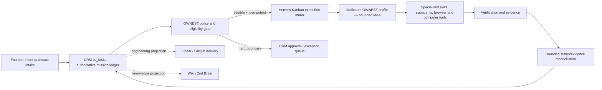

# CRM–Hermes OWNEST Control Plane

**Date:** 12 July 2026

**Status:** Historical dedicated-profile design; design/test implementation only.
Live service installation and canary admission are superseded and blocked by the
current dedicated-UID and independent-verifier requirements

**Decision:** Retain the dedicated-profile design as a test contract. It
does not authorise a live service or canary

**Current build boundary:** `apps/autopilot-runner` emits only the one-file
legacy-runner refusal container. OWNEST policy/adapters are type-check and unit
test inputs only; there is no OWNEST package command, `dist/host`, heartbeat,
presence writer, or host worker. Historic sanitizer plaintext rollback copies
and broader same-UID credential concentration remain a separately authorised
credential-migration blocker.

**Scope:** Unite-Group CRM, the local Hermes runtime, and the Nexus/Pi-Dev-Ops orchestration boundary

## 1. The ownership change

`OWNEST` is the operating contract for **Ownership, Work intake, Nexus orchestration, Execution, Safety, and Telemetry**.

The practical change is simple: the infrastructure owns the work loop. Phill supplies intent, strategy, and the small class of decisions that are truly irreversible. The infrastructure discovers the depth of the request, decomposes it, selects the available skills and agents, executes, recovers from routine failures, verifies the result, and records evidence without using Phill as its default queue or retry mechanism.

The founder is involved only when a task crosses one of these hard boundaries:

1. a production mutation or deployment;
2. spend outside a pre-authorised budget;
3. credential disclosure or a new privilege grant;
4. an irreversible external action;
5. repeated failure, missing evidence, or a policy conflict that the system cannot resolve safely.

The target contract assigns everything else to infrastructure; the current
design/test implementation has not earned that authority.

## 2. Current-state evidence

The design follows the system that exists rather than introducing a replacement stack:

- Unite-Group CRM already contains the authoritative `cc_tasks`, `cc_task_events`, and `cc_evidence_records` surfaces.
- A read-only 12 July snapshot found 42 queued Command Centre tasks, mostly assigned to Hermes and not marked as requiring human approval; this count is not a live invariant.
- The existing `kanban-sync` route already declares the Command Centre as source of truth and generates redacted, idempotent packets, but no worker consumes it.
- Hermes Agent 0.18.2 is already the healthy, launchd-managed runtime and Telegram edge. OpenClaw is a predecessor/migration source exposed through `hermes claw`; it is not a second model or an installed runtime.
- Initial inspection found Hermes MoA installed with no active preset. A later
  in-place sanitizer run reported a reduced dedicated profile and valid bounded
  preset, but security review retired that sanitizer: moving removed credentials
  into same-UID plaintext rollback files did not create isolation. Those historic
  copies now require controlled credential migration. No OWNEST service executes
  the profile; profile/auth validation is not capacity evidence.
- The former `operator_jobs` launchd poller ran from an orphaned worktree and repeatedly polled an empty queue. It is now quarantined and its launcher/installer paths are refusal tombstones.
- Discovery found 21 duplicate enabled `claim job` cron entries and two bridge jobs carrying historical 90-second timeout errors. All 21 duplicate jobs are now paused, both bridge jobs have completed successfully under the 300-second bound, and the orphaned poller remains quarantined.
- Hermes Kanban already supports idempotency keys, runtime limits, retry limits, goal-turn budgets, assignee routing, projects, worktrees, task JSON, and a dispatcher.

The missing component is therefore not another agent framework. It is a safely
isolated, brokered ownership/reconciliation runtime plus an independent verifier;
the repository currently contains only its design/test contracts.

## 3. Architecture decision

Three approaches were evaluated.

### A. Globally switch all Hermes traffic to MoA

This is quick but unsafe. It makes interactive Telegram traffic expensive and slow, amplifies delegation recursively, and leaves the CRM as a passive dashboard. It does not resolve queue authority, duplicate jobs, stale runtime provenance, or evidence reconciliation.

### B. Replace Hermes and Kanban with a new CRM-native executor

This creates a second orchestration engine, duplicates capabilities already present in Hermes, delays useful autonomy, and increases migration risk.

### C. CRM-authoritative missions with a bounded Hermes/MoA execution mirror

This is the retained topology. CRM is the sole mission ledger. Hermes Kanban is
a disposable execution projection. A dedicated `ownest` profile and
`unite-group-ownest` board reserve a bounded MoA lane without inheriting Empire's
crons, gateway, launch agent, aliases, or changing the default/Empire models.
The current package exercises reconciliation through injected tests only; it does
not run a continuous bridge. Linear remains an engineering-delivery projection
linked to the CRM task; it is not the portfolio work authority.

The diagram below is the future topology, not deployed state:



## 4. Authority matrix

| Concern | Authoritative owner | Projection / executor | Rule |
|---|---|---|---|
| Business mission, priority, risk, approval, cancellation | CRM `cc_tasks` and approval records | Hermes, Linear, Wiki | A projection cannot re-open or overwrite CRM authority |
| Orchestration policy and specialised-skill selection | Nexus / OWNEST contract | Dedicated Hermes `ownest` profile | Policy is versioned and evidence-producing |
| Background execution (future) | CRM-admitted isolated worker | OWNEST MoA, skills, subagents | No production executor is currently authorised; any future execution carries the CRM task ID, attempt, rollout, profile, and board |
| Engineering delivery | CRM mission linked to Linear/GitHub | isolated worktree and PR | No direct main/prod mutation |
| Runtime presence (future) | Brokered least-privilege identity | CRM operator/presence views | The former service-role presence/heartbeat writer is deleted; owner labels are not process-health evidence |
| Evidence and outcome | CRM events/evidence | Wiki and task artifacts | No success without a verifiable receipt |
| OpenClaw | none | migration source only | `not-approved` until a real adapter and security review exist |

## 5. Mission contract

Any future dispatched mission would carry this versioned envelope. The
design/test implementation models persistence in `cc_tasks.metadata.ownest` and
Hermes idempotency; no current worker dispatches it.

```ts
interface OwnestMissionStateV1 {
  version: 1
  crmTaskId: string
  idempotencyKey: string
  hermesTaskId: string | null
  attemptId: string
  leaseOwner: string
  leaseExpiresAt: string
  lastHeartbeatAt: string
  dispatchedAt: string | null
  reconciledAt: string | null
  evidenceUri: string | null
  gateState: 'eligible' | 'gated' | 'dead_letter'
  lastError: string | null
  claimedAt: string
  rolloutId: string
  hermesProfile: 'ownest'
  hermesBoard: 'unite-group-ownest'
  integrityNonce: string
  missionDigest: string
  failureCount: number
  failureClass: 'transient' | 'permanent' | 'integrity' | null
  failureCode: string | null
  nextRetryAt: string | null
  completionPhase: 'claimed' | 'dispatched' | 'receipt_validated' | 'artifacts_written' | 'terminal'
  receiptSha256: string | null
  cancelRequestedAt: string | null
  cancelReason: string | null
  stopPhase: string | null
}
```

The idempotency key is a deterministic UUIDv8 projection identity derived from the CRM task, rollout, attempt, profile, and board and formatted as `ownest:<uuid>`. A retry of the same claimed attempt therefore resolves to the same non-archived Hermes task; a later authorised attempt cannot collide with the previous execution.

The `canaryTaskId` and `rolloutId` fields define a future admission contract but
do not authorise admission in the current runtime. If a replacement is later
approved, the fresh founder-scoped CRM state and rebuilt persisted contract must
authorise show, STOP, receipt validation, and recovery. Clearing or advancing a
future canary must never orphan an older projection.

## 6. Eligibility and hard gates

A mission may enter the Hermes mirror only when every condition is true:

- `status = queued`;
- `agent_owner` is `Hermes`, `Nexus`, or `Empire`;
- `human_approval_required = false`;
- risk is `low` or `medium`;
- execution mode is `advisory` for the first canary;
- dependencies are empty or recorded as satisfied;
- the task is not marked cancelled, dead-lettered, or already mirrored;
- the global OWNEST live switch is on and the separately reviewed isolation gate is satisfied;
- the daily dispatch budget and concurrency budget have capacity.

The following always gate instead of executing:

- production deployment or production database mutation;
- payment, purchase, invoice, or spend outside an explicit budget;
- outbound email/message publication where a person or customer is affected;
- secrets access, credential disclosure, or privilege changes;
- destructive deletion, access-control change, branch-protection change, or direct merge;
- tasks marked high/critical risk or requiring approval.

Task titles and objectives are treated as untrusted content. They are passed as fixed process arguments, never interpolated into a shell command. Known secret shapes and PII are redacted before the Hermes body is created.

Environment envelopes and the retired in-place sanitizer are not an OS security
boundary: a same-UID Hermes child can recover other user-readable credentials,
and the sanitizer created plaintext rollback copies under that same UID. A
future executor therefore requires completed credential migration, a dedicated
UID, sealed HOME/workspace, immutable binary digest, brokered operation-scoped
credential, and enforceable egress/tool policy. No general CRM service-role,
provider, payment, social, email, source-control, or deployment credential may
be placed in an OWNEST profile or process.

## 7. Dispatch, lease, and recovery protocol

One bounded tick performs reconciliation before dispatch:

1. Load founder-owned CRM tasks carrying a hardened OWNEST state, plus the exact configured canary; never use the legacy candidate/mirror queries as a fallback.
2. Query Hermes with `kanban show --json` using fixed argv.
3. Renew the CRM metadata lease for live tasks and reconcile terminal state.
4. Append a CRM event only when the state actually changes.
5. Persist a Hermes evidence URI and receipt, then require a separately operated
   verifier to retrieve evidence and validate digests/model-family separation
   before marking `done`.
6. Mark repeated failures as `blocked` with `gateState = dead_letter`; do not bounce routine failure to Phill.
7. Count live OWNEST tasks.
8. Evaluate only the exact configured canary after persisted rollout/daily/concurrency quotas pass; absence, ineligibility, or CAS contention produces no fallback selection.
9. Create it with `hermes --profile ownest kanban --board unite-group-ownest create ... --json`, a deterministic idempotency key, `--goal`, a four-turn goal cap, a ten-minute runtime cap, a retry cap, and a fixed skill allowlist.
10. Persist the mirror ID, attempt ID, lease, and a `started` event back to CRM.

If Hermes creation succeeds but the CRM write fails, the next tick calls create with the same idempotency key and receives the same task. If the process dies after CRM state changes, the lease expires and the next tick reconciles or reclaims it. A missing Hermes task never becomes a false success.

## 8. Reserved MoA policy

MoA is configured only for the reserved OWNEST profile, not for every
interactive chat turn. No continuous OWNEST worker is emitted or installed.

- Historical profile evidence recorded `model.provider = moa`,
  `model.default = default`, and `moa.active_preset = default` for `ownest` only;
  this is not an instruction to mutate or arm the profile.
- Keep both the default/interactive and Empire Hermes profiles on their existing `openai-codex:gpt-5.6-sol` model for fast intent intake and existing scheduled work.
- Change MoA fan-out from `per_iteration` to `user_turn`.
- Cap each reference advisor at 600 output tokens.
- Keep the acting aggregator as the only tool-using model.
- Pin delegated leaf agents to a single non-MoA model during the canary so nested delegation does not multiply advisor calls.
- A future canary contract would use concurrency 1; no live operating cap has been proven.
- Each mission has a runtime cap, goal-turn cap, retry cap, and daily dispatch budget.

This preserves the intended multi-model topology without claiming live capacity
or execution.

## 9. Control and rollback

There is no current OWNEST service stop path because the user-level LaunchAgent
is retired. If a stale plist exists, first block/cancel the CRM mission and
confirm no projection is active, then use the uninstall-only cleanup to bootout
and archive it. Hermes configuration rollback remains backup-first. A future
isolated service must prove a bounded STOP/rollback objective before any canary.

Do not create new plaintext profile/configuration backups. Any future rollback
mechanism must use a brokered/versioned secret plane. The historic same-UID
copies remain untouched until verified replacements are installed and the
founder-authorised migration reaches its revocation/removal step.

## 10. Cutover sequence

1. **Credential and loop hygiene:** complete the founder-authorised credential
   inventory, replacement, consumer migration, rotation/revocation, and safe
   removal sequence without creating new plaintext backups; pause all 21
   orphaned duplicate claim jobs; quarantine the orphaned legacy poller; prove
   both formerly timed-out bridge jobs under the corrected bound; set explicit
   concurrency and assignee limits.
2. **Safety baseline:** manual approvals, fail-closed Tirith, PII redaction, no lazy installs, hard loop stop, verify-on-stop, destructive slash confirmation.
3. **Contract tests:** test eligibility, redaction, fixed-argv Hermes calls, leases, idempotency, reconciliation, dead-lettering, and non-2xx failure handling without emitting or invoking a worker.
4. **Profile reservation after migration:** only after Step 1 is verified, reserve
   the `ownest` profile and board configuration for design validation, configure
   its bounded MoA preset, and keep it non-executing; do not treat profile health
   as runtime capacity or change the default and Empire models.
5. **Isolation/verifier build:** design and adversarially verify the dedicated-UID
   executor, brokered credential, policy boundary, and independent verifier.
6. **Canary (blocked today):** only after Step 5 and a new approval may one
   low-risk advisory CRM task be admitted at concurrency 1.
7. **Proof/decide:** require CRM event/evidence writeback, zero duplicate
   execution, independent completion evidence, and tested STOP/restore before
   any widening proposal.

## 11. Future success measures

- Zero routine no-approval tasks returned to Phill for manual routing.
- Zero duplicate Hermes executions for one CRM task.
- Every running task has a current lease, heartbeat, owner, attempt, and mirror ID.
- Every completed task has CRM evidence and a verifiable URI.
- Stale tasks are reclaimed or dead-lettered automatically.
- The stop path completes within one minute and leaves the CRM ledger intact.
- The stale runner and duplicate cron noise stay at zero.
- Interactive Hermes remains responsive while background missions receive MoA reasoning.

## 12. Explicit non-goals for this cut

- No new orchestration framework or paid tool.
- No OpenClaw installation or invented “OpenClaw model.”
- No production schema migration.
- No autonomous production deploy, database mutation, payment, email send, merge, or branch-protection change.
- No attempt to make one LLM hold the entire knowledge base in context; retrieval, source provenance, bounded prompts, and evidence are the anti-hallucination mechanism.
