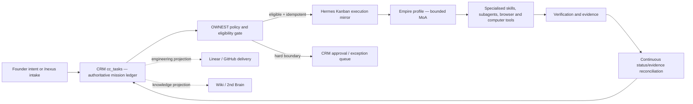

# CRM–Hermes OWNEST Control Plane

**Date:** 12 July 2026

**Status:** Board-approved for a constrained canary; superseded where stricter by `2026-07-12-ownest-canary-hardening-amendment.md`

**Decision:** `APPROVE_BUILD` at 0.85 confidence

**Scope:** Unite-Group CRM, the local Hermes runtime, and the Nexus/Pi-Dev-Ops orchestration boundary

## 1. The ownership change

`OWNEST` is the operating contract for **Ownership, Work intake, Nexus orchestration, Execution, Safety, and Telemetry**.

The practical change is simple: the infrastructure owns the work loop. Phill supplies intent, strategy, and the small class of decisions that are truly irreversible. The infrastructure discovers the depth of the request, decomposes it, selects the available skills and agents, executes, recovers from routine failures, verifies the result, and records evidence without using Phill as its default queue or retry mechanism.

The founder is involved only when a task crosses one of these hard boundaries:

1. a production mutation or deployment;
2. spend outside a pre-authorised budget;
3. credential disclosure or a new privilege grant;
4. an irreversible external action;
5. repeated failure, missing evidence, or a policy conflict that the system cannot resolve safely.

Everything else is infrastructure-owned.

## 2. Current-state evidence

The design follows the system that exists rather than introducing a replacement stack:

- Unite-Group CRM already contains the authoritative `cc_tasks`, `cc_task_events`, and `cc_evidence_records` surfaces.
- The live database currently has 42 queued Command Centre tasks, mostly assigned to Hermes and not marked as requiring human approval.
- The existing `kanban-sync` route already declares the Command Centre as source of truth and generates redacted, idempotent packets, but no worker consumes it.
- Hermes Agent 0.18.2 is already the healthy, launchd-managed runtime and Telegram edge. OpenClaw is a predecessor/migration source exposed through `hermes claw`; it is not a second model or an installed runtime.
- Hermes MoA is installed and configured, but no preset is active. The existing Empire preset uses uncapped, per-iteration advisor fan-out, which is unsuitable for unattended continuous work.
- The current `operator_jobs` launchd poller runs from an orphaned worktree and repeatedly polls an empty queue. It has no lease or crash recovery and does not fail on every non-2xx write.
- Discovery found 21 duplicate enabled `claim job` cron entries and two bridge jobs carrying historical 90-second timeout errors. All 21 duplicate jobs are now paused, both bridge jobs have completed successfully under the 300-second bound, and the orphaned poller remains quarantined.
- Hermes Kanban already supports idempotency keys, runtime limits, retry limits, goal-turn budgets, assignee routing, projects, worktrees, task JSON, and a dispatcher.

The missing component is therefore not another agent framework. It is the ownership and reconciliation loop joining the CRM mission ledger to the existing Hermes executor.

## 3. Architecture decision

Three approaches were evaluated.

### A. Globally switch all Hermes traffic to MoA

This is quick but unsafe. It makes interactive Telegram traffic expensive and slow, amplifies delegation recursively, and leaves the CRM as a passive dashboard. It does not resolve queue authority, duplicate jobs, stale runtime provenance, or evidence reconciliation.

### B. Replace Hermes and Kanban with a new CRM-native executor

This creates a second orchestration engine, duplicates capabilities already present in Hermes, delays useful autonomy, and increases migration risk.

### C. CRM-authoritative missions with a bounded Hermes/MoA execution mirror

This is the approved design. CRM is the sole mission ledger. Hermes Kanban is a disposable execution projection. The Empire profile runs eligible background missions through a bounded MoA preset. A continuous bridge reconciles Hermes status and evidence into CRM. Linear remains an engineering-delivery projection linked to the CRM task; it is not the portfolio work authority.



## 4. Authority matrix

| Concern | Authoritative owner | Projection / executor | Rule |
|---|---|---|---|
| Business mission, priority, risk, approval, cancellation | CRM `cc_tasks` and approval records | Hermes, Linear, Wiki | A projection cannot re-open or overwrite CRM authority |
| Orchestration policy and specialised-skill selection | Nexus / OWNEST contract | Hermes Empire profile | Policy is versioned and evidence-producing |
| Background execution | Hermes Kanban worker | Empire MoA, skills, subagents | Every execution must carry the CRM task ID |
| Engineering delivery | CRM mission linked to Linear/GitHub | isolated worktree and PR | No direct main/prod mutation |
| Runtime presence | Hermes process heartbeat | CRM operator/presence views | Owner labels are not process-health evidence |
| Evidence and outcome | CRM events/evidence | Wiki and task artifacts | No success without a verifiable receipt |
| OpenClaw | none | migration source only | `not-approved` until a real adapter and security review exist |

## 5. Mission contract

Every dispatched mission carries a versioned envelope. The first implementation persists it in `cc_tasks.metadata.ownest` and uses Hermes' native idempotency key.

```ts
interface OwnestMissionStateV1 {
  version: 1
  crmTaskId: string
  idempotencyKey: string
  hermesTaskId: string | null
  attemptId: string
  leaseOwner: string
  leaseExpiresAt: string
  lastHeartbeatAt: string
  dispatchedAt: string | null
  reconciledAt: string | null
  evidenceUri: string | null
  gateState: 'eligible' | 'gated' | 'dead_letter'
  lastError: string | null
}
```

The idempotency key is deterministic: `cc-task:<crm-task-id>:v1`. A retry therefore resolves to the existing non-archived Hermes task instead of creating another execution.

## 6. Eligibility and hard gates

A mission may enter the Hermes mirror only when every condition is true:

- `status = queued`;
- `agent_owner` is `Hermes`, `Nexus`, or `Empire`;
- `human_approval_required = false`;
- risk is `low` or `medium`;
- execution mode is `advisory` for the first canary;
- dependencies are empty or recorded as satisfied;
- the task is not marked cancelled, dead-lettered, or already mirrored;
- the global OWNEST live switch is on;
- the daily dispatch budget and concurrency budget have capacity.

The following always gate instead of executing:

- production deployment or production database mutation;
- payment, purchase, invoice, or spend outside an explicit budget;
- outbound email/message publication where a person or customer is affected;
- secrets access, credential disclosure, or privilege changes;
- destructive deletion, access-control change, branch-protection change, or direct merge;
- tasks marked high/critical risk or requiring approval.

Task titles and objectives are treated as untrusted content. They are passed as fixed process arguments, never interpolated into a shell command. Known secret shapes and PII are redacted before the Hermes body is created.

## 7. Dispatch, lease, and recovery protocol

One bounded tick performs reconciliation before dispatch:

1. Load CRM tasks already carrying an OWNEST mirror ID.
2. Query Hermes with `kanban show --json` using fixed argv.
3. Renew the CRM metadata lease for live tasks and reconcile terminal state.
4. Append a CRM event only when the state actually changes.
5. Persist a Hermes evidence URI and validation receipt before marking `done`.
6. Mark repeated failures as `blocked` with `gateState = dead_letter`; do not bounce routine failure to Phill.
7. Count live OWNEST tasks.
8. Select the oldest/highest-priority eligible queued task up to the remaining concurrency capacity.
9. Create it with `hermes --profile empire kanban create --json`, a deterministic idempotency key, `--goal`, a maximum turn count, a maximum runtime, a retry cap, and a fixed skill allowlist.
10. Persist the mirror ID, attempt ID, lease, and a `started` event back to CRM.

If Hermes creation succeeds but the CRM write fails, the next tick calls create with the same idempotency key and receives the same task. If the process dies after CRM state changes, the lease expires and the next tick reconciles or reclaims it. A missing Hermes task never becomes a false success.

## 8. Continuous MoA policy

MoA is continuous for background Empire missions, not for every interactive chat turn.

- Persist `model.provider = moa`, `model.default = default`, and `moa.active_preset = default` in the Empire profile only.
- Keep the default/interactive Hermes profile on `openai-codex:gpt-5.6-sol` for fast intent intake.
- Change MoA fan-out from `per_iteration` to `user_turn`.
- Cap each reference advisor at 600 output tokens.
- Keep the acting aggregator as the only tool-using model.
- Pin delegated leaf agents to a single non-MoA model during the canary so nested delegation does not multiply advisor calls.
- Canary concurrency is 1. The proven operating cap is 3 globally and 2 per profile.
- Each mission has a runtime cap, goal-turn cap, retry cap, and daily dispatch budget.

This gives the system deep multi-model reasoning where it compounds value while keeping simple intake responsive and predictable.

## 9. Control and rollback

The one-minute stop path is layered:

1. turn off the OWNEST worker live switch so no new mission is mirrored;
2. block or cancel queued CRM missions from Mission Control;
3. stop the launchd OWNEST worker;
4. stop the Hermes gateway only for a runtime-wide emergency;
5. restore timestamped Hermes configuration backups and restart the gateway.

Stopping only the Hermes PID is not a valid kill switch because launchd uses `KeepAlive`. The service must be unloaded or stopped through Hermes/launchd.

No runtime change is applied without preserving file mode and a timestamped backup. No source-tree update is attempted while the Hermes checkout is dirty.

## 10. Cutover sequence

1. **Hygiene:** pause all 21 orphaned duplicate claim jobs; quarantine the orphaned legacy poller; prove both formerly timed-out bridge jobs under the corrected bound; set explicit concurrency and assignee limits.
2. **Safety baseline:** manual approvals, fail-closed Tirith, PII redaction, no lazy installs, hard loop stop, verify-on-stop, destructive slash confirmation.
3. **Bridge in shadow:** build and test eligibility, redaction, fixed-argv Hermes calls, leases, idempotency, reconciliation, dead-lettering, and non-2xx failure handling.
4. **Runtime activation:** enable the bounded Empire MoA preset while keeping the default interactive model unchanged.
5. **Canary:** dispatch exactly one low-risk advisory CRM task at concurrency 1.
6. **Proof:** require CRM event/evidence writeback, zero duplicate execution, a healthy Hermes gateway, and a tested stop/restore drill.
7. **Widen:** raise the execution cap to 3 only after the canary proof is clean.

## 11. Success measures

- Zero routine no-approval tasks returned to Phill for manual routing.
- Zero duplicate Hermes executions for one CRM task.
- Every running task has a current lease, heartbeat, owner, attempt, and mirror ID.
- Every completed task has CRM evidence and a verifiable URI.
- Stale tasks are reclaimed or dead-lettered automatically.
- The stop path completes within one minute and leaves the CRM ledger intact.
- The stale runner and duplicate cron noise stay at zero.
- Interactive Hermes remains responsive while background missions receive MoA reasoning.

## 12. Explicit non-goals for this cut

- No new orchestration framework or paid tool.
- No OpenClaw installation or invented “OpenClaw model.”
- No production schema migration.
- No autonomous production deploy, database mutation, payment, email send, merge, or branch-protection change.
- No attempt to make one LLM hold the entire knowledge base in context; retrieval, source provenance, bounded prompts, and evidence are the anti-hallucination mechanism.
