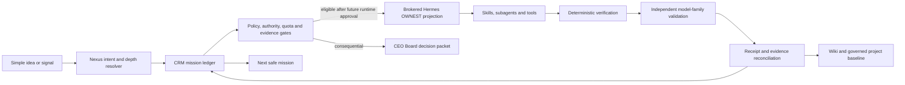

# Nexus Agentic Automation Foundation

**Date:** 12 July 2026

**Status:** Architecture baseline plus design/test controls. The configured
repository-readiness scanner reports 10 pass / 0 fail / 0 unknown / 0 blocking;
production, credential migration, autonomous runtime, service installation,
live admission, merge, and spend gates remain closed

**Scope:** Unite-Group CRM, Nexus, Hermes/OpenClaw migration surface, Pi-Dev-Ops specialised skills, 2nd Brain/Wiki, model routes, project readiness, weekly vendor intelligence, and the first industry-image reference workload

## 1. Outcome

The target is an operating system, not a parts catalogue:

1. a small idea enters through `/nexus`, CRM, Telegram, or an approved intake;
2. Nexus establishes the real objective, constraints, authority, evidence bar, and likely downstream moves;
3. CRM records the immutable mission and remains the authority for priority, risk, approval, cancellation, and outcome;
4. the system selects existing skills, tools, model families, and agents before proposing anything new;
5. after credential migration and isolation/verifier gates are proven, a future
   brokered executor projects one bounded mission through the dedicated OWNEST profile;
6. deterministic checks and independent model families validate the work;
7. evidence, usage, failures, and recovery are reconciled into CRM and the Wiki;
8. the completed project continues operating while the same readiness factory advances to the next project.

Phill owns strategy and consequential decisions. The infrastructure owns routine discovery, decomposition, execution, recovery, validation, evidence, and maintenance. It must not turn normal retries or missing glue into founder work.

## 2. What exists and what is genuinely missing

This is an integration and governance build, not a new agent framework.

| Layer | Reuse now | Missing load-bearing capability |
|---|---|---|
| Authority | Unite-Group `cc_tasks`, task events, evidence records | Isolated brokered executor plus independent completion verifier; current OWNEST code is design/test-only |
| Orchestration | Nexus, CEO Board, specialised skills, Hermes Kanban | Automatic intent expansion, skill-gap resolution, and evidence-bound routing |
| Execution | Hermes, browser, Playwright, computer-use, subagents | Explicit tool triggers plus a dedicated-UID, brokered, independently verified OWNEST runtime |
| Research | Apify, Firecrawl, Exa/Margot, browsers | Rights-aware source routing, provenance schema, deduplication, evaluation |
| Models | Observed provider configuration/authentication for OpenAI, Anthropic, Gemini, MiniMax, OpenRouter/local options | Attested execution capacity, model-family registry, auth-class policy, family-excluding validation |
| Evaluation | Synthex offline AI evals, tests, CI, gstack benchmark adapters | Common receipt schema, blind comparison, calibrated independent judges |
| Knowledge | Wiki/2nd Brain and project Markdown | One governed current-platform baseline per project plus material-change updates |
| Operations | launchd, Hermes cron, GitHub Actions, Docker | One reusable project readiness manifest, clean stop/recovery, observable schedules |

No new paid product is justified until an existing route has failed a non-secret readiness check and the Board has accepted the cost and operational impact.

## 3. Authority and execution topology



Rules:

- CRM is authoritative; Hermes, Linear, GitHub, the Wiki, and model conversations are projections.
- The dedicated `ownest` profile and `unite-group-ownest` board are the reserved MoA projection lane; no continuous OWNEST service is authorised or installed.
- The default and Empire profiles retain their existing models and workloads.
- One CRM claim maps to one attempt, one rollout identity, and one Hermes projection.
- Production, spend, credentials/privileges, external publication, destructive action, and merge/deploy remain explicit gates.
- A model verdict cannot override a failed test, schema, source, secret, policy, tenant, or safety gate.

## 4. Automatic `/nexus` intake contract

Nexus must derive a mission packet before choosing tools:

```yaml
schema: nexus.mission.v1
intent:
  stated_request: string
  real_objective: string
  outcome_definition: string
  non_goals: [string]
context:
  projects: [string]
  sources_of_truth: [uri]
  current_commit: string
  assumptions: [string]
authority:
  risk: low|medium|high|critical
  allowed_mutations: [string]
  prohibited_mutations: [string]
  approval_gates: [production, spend, privilege, external, destructive, merge]
work:
  horizons: [now, next, later]
  anticipated_moves: [string]
  required_disciplines: [string]
  existing_skills: [string]
  missing_capabilities: [string]
  tool_triggers: [string]
verification:
  deterministic_gates: [string]
  evidence_requirements: [string]
  validator_families: [string]
  completion_receipt: ownest.completion.v1
```

The anticipated-moves field is a dependency and risk forecast, not permission to execute twenty speculative actions. Each move becomes executable only when it is the smallest safe next step inside the mission authority.

### Tool triggers

The router must state why a tool is or is not used:

- Browser or Exa: current facts, official sources, broad discovery, link verification.
- Firecrawl: stable page extraction, structured crawl, Markdown capture, changed-section retrieval.
- Apify: an existing Actor is a fit, durable scheduled extraction is required, or a dataset/run receipt adds value.
- Playwright: repeatable browser flow, authenticated web QA, screenshots, network/console evidence.
- Computer-use: a local GUI or browser surface cannot be controlled through a safer structured interface.
- MCP: a configured connector owns the target capability and passes an auth/readiness check.
- Docker: environment parity, dependency isolation, integration tests, or reproducible benchmarks.
- Subagents: two or more independent research, review, or implementation streams can run without overlapping writes.

Authentication is consumed through configured CLIs, connectors, environment references, or secret stores. Raw usernames, passwords, keys, or tokens are never copied into prompts, logs, CRM metadata, receipts, or Markdown.

## 5. Reusable project readiness factory

Every project receives a versioned `nexus.project-runtime.v1` manifest and the same evidence-producing audit. Unknown is a valid result; unknown never becomes green.

### Audit domains

| Domain | Required observations | Promotion evidence |
|---|---|---|
| Repository | clean/dirty state, branch, upstream, worktrees, ignored/generated load | exact commit and scoped diff |
| Loops | crons, pollers, retries, backoff, cancellation, duplicate claimers | inventory plus duplicate/stall tests |
| Hooks | Git hooks, CI triggers, webhooks, signatures, replay/idempotency | hook map and failure-mode tests |
| Harnesses | unit/integration/e2e/eval/load/security checks and engines | actual commands, duration, result |
| SSH | config references, deploy keys, host aliases, agent forwarding | presence and least-privilege status only; never key material |
| MCP | server definitions, transports, owners, auth source, scopes | non-secret list/init/read smoke |
| Connections | provider, database, queue, storage, browser and SaaS routes | source of truth, health, timeout, retry, fallback |
| Containers | Dockerfiles, Compose, running/stale containers, image age, volumes | pinned build/smoke and cleanup plan |
| Packages | package managers, lockfiles, engine parity, missing/stale/vulnerable deps | frozen install, audit evidence, compatibility gate |
| Bloat/cache | build output, node_modules, stale worktrees, logs, duplicate skills, generated docs | measured bytes/counts and reversible removal |
| Documentation | source-of-truth conflicts, stale model IDs, dead links, unowned runbooks | governed baseline and link/schema checks |
| Telemetry | task/run IDs, usage, latency, tool errors, retries, intervention | receipt schema and bounded retention |
| Data/evaluation | provenance, rights, splits, contamination, holdouts, metrics | deterministic gates plus saved baseline |
| Security | secret surfaces, RLS/tenant scope, redirect/SSRF, permissions, production gates | secret scan and explicit risk result |
| Model routing | family, endpoint, auth/billing class, fallback, limits | no-surprise-spend and independent validation |

### Factory stages

1. Freeze project identity and current commit.
2. Read local instructions and source-of-truth documents.
3. Run the read-only inventory and record unknowns.
4. Remove duplicate work and reversible bloat with measured before/after evidence.
5. Repair harnesses, launchers, locks, and missing packages only when required by an active capability.
6. Establish deterministic offline gates.
7. Add container parity where host-only results are unreliable.
8. Classify every model route by family and auth class.
9. Run bounded heterogeneous validation.
10. Prove cancellation, crash recovery, rollback, and no duplicate execution.
11. Commit one governed runtime baseline and runbook.
12. After credential migration, dedicated isolation, and an independent verifier
    are proven, request approval to admit one low-risk task through OWNEST.
13. If approved, observe it to a valid independently verified completion receipt.
14. Keep the cleaned project working at its proven limit.
15. Advance the factory to the next project.

Project 1 is Unite-Group because it owns the control plane. Synthex is the next workload because it already has a deterministic offline AI evaluation harness and is the natural home for the industry-image reference use case.

### Project 1 readiness snapshot

The current deterministic scan reports 10 pass / 0 fail / 0 unknown / 0
blocking. The previous four P1 classes were closed in this branch: inert nested
workflows were removed or replaced at the root, external container images were
digest-pinned, missing/dynamic container inputs were reconciled, and active
package/CI/container engines were aligned to Node 24.14.1. The scanner result is
repository evidence, not production or autonomy approval.

The autopilot runner's development toolchain was separately upgraded to Vitest
4.1.10 and its dependency audits reported zero known vulnerabilities. Its
reviewed build manifest now permits exactly one surface: `src/index.ts` emits
only `dist/container/index.js`, the legacy-runner refusal tombstone. There is no
`dist/host`, OWNEST package command, presence/heartbeat source, or emitted host
worker. The OWNEST CRM/Hermes code remains available only to type-check and unit
test the proposed contracts.

A separate operational blocker remains outside the readiness scanner's current
file/config checks. A names-only host audit found broad same-UID credential
concentration and historic plaintext rollback copies created by the former
OWNEST profile sanitizer. The sanitizer now refuses before reading the profile,
but the retained credentials still require a founder-authorised inventory,
rotation/relocation, verified consumer migration, revocation, and then safe
removal. No OWNEST or presence service may be armed before both that migration
and the isolated brokered runtime/independent-verifier architecture are proven.

The legacy hosted `CC_LINEAR_LIVE` executor is permanently retired, not merely switched off. Review found that its untrusted Claude worker shared a Unix identity, PID namespace, and linked Git administration directory with the privileged parent; it could inherit or recover control-plane credentials, poison Git hooks/filters before privileged publication, leave descendants, and pass a vacuous `true` gauntlet. Exact `CC_LINEAR_LIVE=1` now exits 2 before configuration, credentials, filesystem, subprocess, Git, or network access. Both authenticated web claim/handoff routes return `410` without Linear imports, and the older Empire Mission Control launcher exits `2` before imports or environment access. Linear queue health is now a read-only retired-projection inventory, not a stale/healthy executor signal. GitHub Actions builds and smokes the one-file image as non-root with no network, a read-only filesystem, dropped capabilities, resource limits, no Git/Claude/Hermes binaries, and sentinel credential checks. Re-enabling hosted authoring requires a new separately isolated UID/PID/filesystem/network executor with brokered operation-scoped credentials; an environment change cannot reactivate it.

Package and harness hardening evidence captured during this slice is listed
below. The branch continued changing after some runs, so these snapshots do not
replace the required fresh final verification at the eventual PR head:

- root verification and GitHub Actions now share a build-only web wrapper with fixed non-secret structural placeholders, an exact child environment, Node >=24.14.1 <25, and pnpm 9.15.0; every active package and reviewed container surface uses the same Node >=24.14.1 <25 contract;
- the web lock fell from 20,696 to 14,346 lines after disabling unused automatic peer installation, and a clean frozen install reduced its generated dependency tree from the observed stale 4.4 GB to 1.2 GB with no Nuxt, Vue, Svelte, or Remix packages; lint, type-check, 519 files/3,190 tests, build, production audit, and complete audit are green;
- spec-board and the Pi-CEO operator MCP both have frozen-install, build/test where present, and zero-audit evidence; their temporary PostCSS and esbuild security overrides cross upstream-declared version constraints, so they remain explicit compatibility exceptions that expire when Next and Skybridge natively accept the patched lines;
- workspace Vite 7.3.6 legitimately removes the vulnerable esbuild 0.27 path. Monaco and its 73 MB local footprint were then removed rather than false-greened with an override: its two narrow drafting surfaces now share one accessible native editor, the jsDelivr script/style CSP allowance is gone, and both production and complete dependency audits report zero known vulnerabilities. The remaining DOMPurify path is the patched 3.4.11 copy through Lobehub/Mermaid;

## 6. Multi-model execution without self-validation

Independence is defined by the underlying model family, not the gateway or account. Claude through OpenRouter is still Anthropic; GPT through Hermes is still OpenAI.

Each route must declare:

```yaml
provider: string
model: string
model_family: openai|anthropic|google|minimax|local|other
endpoint_class: direct|hermes|openrouter|local
auth_class: consumer_subscription|commercial_api|prepaid_api|aggregator_api|local_model|unknown_blocked
plan_id: string
metered_overflow: disabled|board_approved
allowed_workloads: [string]
```

### Subscription and API isolation

An installed CLI is not proof that its included subscription capacity is being used. The executor must attest the active authentication path before work, because ambient environment variables can silently change billing class. In particular, Anthropic documents that `ANTHROPIC_API_KEY` takes precedence over Claude Pro/Max sign-in and causes API charges; Codex likewise supports materially different ChatGPT-sign-in and API-key routes.

Every subscription-backed executor therefore runs through a route-specific environment envelope:

- the Claude Max lane requires `claude auth status` to report `loggedIn: true`, `authMethod: claude.ai`, and `subscriptionType: max`, then removes Anthropic API, Bedrock, Vertex, and Foundry credential selectors from the child process;
- the Codex plan lane requires `codex login status` to report ChatGPT sign-in and removes API/provider overrides that would select a metered route;
- API, OpenRouter, and cloud-provider lanes run in separate child environments, carry an explicit spend class and budget, and never inherit subscription credentials;
- a route whose billing identity cannot be attested is `unknown_blocked`, not an automatic fallback;
- no wrapper sources a broad project `.env.local` and then launches every model CLI with the resulting ambient environment;
- consumer-subscription lanes run only through vendor-supported local CLI/app surfaces and their published plan terms; credentials are never transplanted into a container, API service, or shared daemon to imitate an API entitlement;
- receipts record the attested route ID and auth class, never the credential or raw authentication output.

These controls are the prerequisites for using existing Max plans without
allowing a convenience fallback to become unreported spend. Current evidence is
auth-only: successful Claude/Codex sign-in and provider configuration do not
prove that an autonomous executor consumed plan capacity, that capacity remains,
or that a receipt was billed to the intended subscription. Until route-specific
execution receipts and vendor-supported usage telemetry exist, capacity is
`unknown`, not active or available.

Validation sequence:

1. freeze prompt, rubric, source set, skill hashes, and hard gates;
2. execute deterministic checks first;
3. generate with family G;
4. remove model identity and randomise presentation;
5. validate with family V1, where V1 is not G;
6. for high-value or disputed work, validate with a second independent family V2;
7. adjudicate disagreement with a third family or the CEO Board;
8. store native usage, model family, evidence, rubric version, and verdict in CRM;
9. prohibit the generator or MoA aggregator from promoting its own output.

Quality scores are secondary to hard gates. Promotion requires zero policy/secret failures, all deterministic gates green, representative cases with repeated runs, no material quality regression, and measured reliability. The existing benchmark's single-family quality judge is therefore evidence of one opinion, not an independent gate.

## 7. Evaluation and training evidence

The common `nexus.eval.run.v1` record retains native provider usage fields before normalisation: input, cached, output, reasoning/thought, tool-context tokens, latency phases, retries, cost or subscription units, hard gates, blinded validators, artifact hashes, and the exact project/container/harness version.

Closed vendors' neural architecture, loss, training corpus, and training algorithm remain `unknown` unless the vendor publishes them. They must never be inferred from outputs.

A local or fine-tuned model additionally requires base checkpoint and tokenizer hashes, architecture source, licensed dataset manifest, split hashes, contamination tests, loss/optimiser/schedule/seed, learning curves, task and safety metrics, calibration, hardware/container digest, quantisation, latency, memory, and token throughput.

## 8. Weekly top-tier documentation intelligence

The current branch implements a monitor that reads only authoritative vendor sources. Remote documentation is untrusted input: redirects stay inside an allowlist, active content is stripped, examples are never executed, and materiality is determined from normalised hashes and extracted facts before a model sees the content.

### Initial registry

| Vendor | Change sources |
|---|---|
| OpenAI | `https://developers.openai.com/api/docs/changelog`, deprecations, model catalogue, token counting, evals, Codex changelog/models/plan usage |
| Anthropic | Platform and Claude Code release notes, token counting, legal/authentication, data usage, Access Transparency |
| Gemini | API changelog, models, deprecations, token accounting, rate limits |
| Hermes | official GitHub releases, CLI/MoA reference, fallback-provider documentation |
| Apify | platform/CLI/SDK changelogs, API v2, MCP documentation |
| Firecrawl | product changelog, `llms.txt`, official GitHub releases |
| Exa | official changelog, `llms.txt`, contents/search references |

Coverage disposition verified 12 July 2026: every item in this initial registry has a distinct, current official source, so none is silently collapsed as duplicative or marked unavailable. The previously implicit items are governed separately as `openai.api.models`, `openai.codex.plan-usage`, `anthropic.platform.authentication`, `anthropic.platform.data-retention`, `gemini.api.deprecations`, `hermes.docs.mixture-of-agents`, `hermes.docs.fallback-providers`, `apify.cli.changelog`, `apify.integrations.mcp`, and `exa.docs.search` in `config/nexus-official-sources.json`.

### Materiality

- `P0 BLOCK`: security, legal, auth, retention, active-model shutdown, imminent breakage, or new spend exposure.
- `P1 ACTION`: model ID, tokenizer, context, inference/usage field, SDK/API schema, pricing, or rate-limit change affecting an active capability.
- `P2 REVIEW`: useful capability or performance improvement not yet used.
- `P3 INFO`: editorial or non-semantic change.

The current branch's watcher classifies and gates material fingerprint changes but
does not create CRM rows, CEO Board packets, Telegram messages, draft branches,
or project Markdown patches. Those are target workflow stages. Nothing in the
current workflow auto-merges or mutates production.

### Implemented cadence in Australia/Brisbane

- The branch defines a Sunday 02:17 GitHub Actions schedule for one read-only
  fetch/fingerprint comparison against the committed registry and baseline; it
  is not active on `main` while the merge gate remains closed.
- When dispatched, the workflow tests the watcher first, writes JSON/Markdown plus a candidate
  baseline under an artifact directory, gates material changes, and retains the
  uploaded evidence for 30 days.
- The branch's root CI job tests the watcher on Node 24 without performing external
  source requests.
- There is no implemented daily watcher, CRM/Board write, Telegram delivery,
  monthly benchmark dispatch, automatic PR, or automatic Markdown update.

### Target cadence (not yet implemented)

- Daily 05:15: conditional ETag/Last-Modified/hash fingerprint for critical sources; no model call when unchanged.
- Sunday: one idempotent CRM run, material-change analysis, isolated compatibility checks, evidence/Board packet creation, and a link-only Telegram summary.
- First Sunday monthly: run the saved cross-model benchmark corpus.

The target governance model gives each project one `docs/platform-current.md`
and one machine-readable runtime manifest. A no-change week should update only
the evidence ledger; a material change should patch only the governed section
through a reviewable PR. Neither behaviour exists yet.

## 9. Anthropic Access Transparency boundary

Access Transparency is organisation-level, request-only, contract-dependent, and delivered through the Compliance API. It covers eligible Claude Messages API and Claude Code API-key traffic. It does not cover Claude Free, Pro, or Max, Claude for Work/Enterprise seats, Chrome, Batch, or Files. It records covered human access, may arrive up to two business days later, is not a real-time security alert, and does not prove that automated processing did not occur.

The currently authenticated Claude Code Max session is therefore not eligible. An Anthropic credential entry does not prove a Compliance Access Key, ZDR, CMEK, or Access Transparency entitlement. State remains `unknown/not_enabled` until organisation and contract evidence exists.

## 10. First specialised workload: Industry Image Reference Foundry

This workload is the proving ground for the general skill factory, not a one-off downloader.

### Reuse verdict

- Extend the existing Apify connector, browser/Playwright/computer-use capabilities, Nexus intake, client visual-art direction, brand guardian, and Synthex evaluation/storage surfaces.
- Add one orchestration skill only where no existing skill owns rights-aware discovery, normalisation, provenance, similarity, and reference-pack generation end to end.
- Use Apify, Firecrawl, and Exa together by role; they are not three redundant first choices.

### Verified Synthex foundation

Read-only inspection on 12 July 2026 found the implementation substrate in both
the local checkout at `05b2aba448594023a560e6df898991a02a3dba99` and
`origin/main` at `b3124854a1963599e8d4062f9314c34fc640807a` after a live
fetch. The local checkout was dirty (one untracked handoff) and 118 commits behind `origin/main`,
so it is provenance evidence, not a frozen current baseline. The named files and
locked dependencies were also confirmed directly on `origin/main`:

- `scripts/marketing-agency-apify-intelligence.ts` runs selected Actors and records run/dataset outcomes;
- `lib/auto-research/apify/client.ts` is the shared typed Actor/dataset adapter;
- `lib/marketing-agency/research/apify-intelligence.ts` normalises and ranks creative records;
- `lib/marketing-agency/intelligence/apify-signal-adapter.ts` maps them into governed signals;
- `apify-client` and `@mendable/firecrawl-js` are locked dependencies;
- the Apify token passes a non-secret live identity check and is present in Synthex's Development, Preview, and Production Vercel environments.

This is still incomplete for the Foundry. The current creative record has no actor/run/dataset identity, licence or terms evidence, content checksum, media type/dimensions, rights class, retention decision, or exact/near-duplicate identity. Its `permissionContext: 'public'` assignment is inferred from visibility and is not sufficient rights evidence. The existing social Actor list must therefore be re-approved per actor, price, input schema, target terms, and intended use before any run.

Firecrawl code is installed and used elsewhere in Synthex, but no Firecrawl credential was found in the inspected local or Vercel environment names. No Exa package or credential was found in Synthex, and Hermes also reports Exa as unconfigured. Choice 1 therefore remains the target router—Apify for durable Actor runs/datasets, Firecrawl for stable extraction, Exa for discovery/highlights—but Firecrawl and Exa must report `blocked_unconfigured` until an already-owned credential is connected. Browser/plain HTTPS remains the no-new-spend fallback. No paid Actor was run during discovery.

### Pipeline

1. turn industry, job, asset type, audience, locale, style, constraints, and desired learning into a reference brief;
2. discover authoritative, manufacturer, standards, trade, editorial, stock/licensed, and public-domain candidates;
3. retrieve metadata and previews through the least expensive suitable existing route;
4. preserve source URL, creator/publisher, observed licence, terms URL, capture time, retrieval method, checksum, dimensions, MIME type, and usage restrictions;
5. quarantine unknown or prohibited rights instead of treating public visibility as reuse permission;
6. validate MIME, dimensions, corruption, malware, redirects, private-network access, and content policy;
7. remove exact duplicates by SHA-256 and near duplicates by perceptual hash/embedding;
8. score technical quality, relevance, diversity, provenance completeness, rights confidence, and brand fit;
9. cluster by subject, process, angle, material, environment, era, safety condition, and visual grammar;
10. generate a compact reference pack and image-generation brief without copying protected expression;
11. have an independent vision/model family and brand/art-direction rubric audit the pack;
12. retain evidence and permitted thumbnails according to rights/retention policy; retain metadata-only records when image storage is not authorised.

The library is a provenance graph and retrieval index, not an unbounded folder of scraped images. Training use, fine-tuning use, internal reference use, transformation, and publication are separate rights fields.

## 11. Twenty-move rollout

1. Complete the CRM/Hermes receipt, STOP, cancellation, and reconcile-first design/test state machine.
2. Retain the historical dedicated profile/board evidence without treating it as a runtime or capacity proof.
3. Disable the latent Anthropic round-robin route without exposing credentials.
4. Repair the standalone Codex launcher or formally route Codex through Hermes.
5. Record all model routes by family, auth class, limits, and spend policy.
6. Commit the project runtime manifest and readiness audit command.
7. Commit the official-source registry and material-change schema.
8. Run one read-only weekly-doc capture canary.
9. Produce the first Unite-Group platform impact report.
10. Finish deterministic completion artifacts and partial-write repair.
11. Design and build the dedicated-UID executor, sealed workspace, pinned binary, brokered CRM credential, and egress/tool policy.
12. Implement the separately operated evidence/digest/model-family completion verifier.
13. Prove isolation, stop, rollback, no duplicate execution, and receipt integrity under adversarial tests.
14. Only then ask the Board whether to admit one CRM-nominated advisory OWNEST canary.
15. Freeze Synthex at the current `origin/main` commit and run its readiness audit.
16. Extend Synthex's offline eval envelope and add Docker-pinned deterministic execution.
17. Build the rights/provenance schema and reference-foundry golden cases.
18. Run bounded Apify/Firecrawl/Exa research against official and licensed sources.
19. Blind outputs and calibrate family-excluding validators, then admit the image-reference skill only through an approved one-task gate.
20. Keep each proven project operating at its measured limit and advance the factory project by project.

## 12. Promotion scorecard

The system does not claim “100% autonomy.” It earns wider authority through evidence:

- 100% hard gates on the admitted workload;
- zero duplicate claims/projections;
- zero secret, tenant, policy, production, spend, or outbound violations;
- valid receipt and durable evidence before CRM completion;
- stop/rollback within the declared objective with no unsafe redispatch;
- at least 95% pilot completion reliability and 98% before broad autonomy;
- measured reduction in founder interventions, retries, token waste, stale jobs, and documentation noise;
- validator agreement measured and calibrated rather than assumed;
- every unknown remains visible until measured.
